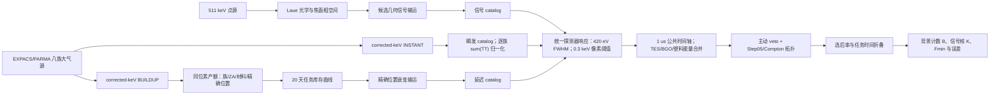

# SH3 OptV3 OpenCode 会话与 M05 统计闭合审计（2026-08-20）

## 技术摘要

结论分三部分：

1. **昨天的代码和执行有实质问题。** 信号束平移和实 Step05 移植本身通过验证，但 gamma 扩展写入目录与分析配置读取目录不一致；`round005` 的 canary 与正式任务还复用了确定性种子。旧 catalog/timeline 另有缺失几何头校验、缺失轮次静默跳过、延迟本底谱系归因不符合 M05 exact-position 合同、漏乘 45 度斜程大气透射、漏计信号偶然符合损失，以及把 `S/sqrt(B+S)` 误标成 Asimov 等问题。
2. **输运统计量昨夜跑完了，统计后处理没有跑完。** 32 个 gamma 扩展轮均于 2026-08-20 05:10 完成，共 102,647,616 个初级粒子、256 个正式收据和 52.68 GB SIM；OpenCode 会话停止时只看到 `round005` 的 6/8。由于上述种子复用，`round005` 被排除；有效扩展是 `round006`--`round036` 的 99,439,878 个初级粒子。加原有四轮后，最终 catalog 使用 112,421,262 个 gamma 初级粒子。
3. **缺失后处理已补全并独立复算通过。** 20 天 W2 窗口的候选自身 3σ Gaussian 最小可分辨通量为

   **Fmin = (2.22937 ± 0.20862) × 10⁻⁵ ph cm⁻² s⁻¹**，

   其中阈值的“3σ”是发现显著性定义，`±0.20862 × 10⁻⁵` 是该阈值的 **1σ 统计标准误差**，相对误差 9.358%。Cowan-Asimov 3σ 阈值为 `2.23829 × 10⁻⁵ ph cm⁻² s⁻¹`。

该结果是 **SH3 OptV3 candidate-own 诊断结果**，不是 SG3B 对比提升结论，也不是全链物理 authority 的恢复。误差仅含有限输运、时间线重放、信号 Aeff 和偶然符合探针的统计项；未含大气、源模型、响应、几何、光学及 Step05 圆盘定义等系统误差。

## 项目主要意图与 M05 流程纲要

项目的核心目标不是单独把 511 keV 峰做高，而是在同一几何、同一源单位合同、同一响应/符合逻辑和同一任务时间轴下，将聚焦信号、瞬发大气本底与活化延迟本底变成可审计、可归一化、可比较的 20 天灵敏度。当前源单位修复包要求所有八族连续谱使用 corrected-keV 文件，禁止回到 `cosima_spectra_dp_2602units`；宽带 gamma 已含湮没隆起，不能再叠加独立 mono-511 sidecar。

M05 的关键不变量是：三路样本必须在公共时间轴上形成带标记 Poisson 过程；相邻间隔不超过 1 µs 的事件做传递闭包分组；先分别累加 TES/BGO/塑料能量，再统一施加响应、veto 和 Step05；延迟本底必须按 `(family, ZA)` 的库存曲线和精确位置谱系折叠；每个瞬发族按自己的 `sum(TT)` 归一化。信号侧还要乘 45° 斜程大气透射和公共时间轴下的偶然符合存活率。

## OpenCode 会话复原

审计对象为 OpenCode session `ses_fe7019862ffe2rAR49M2VuFVT9`（标题 `New session - 2026-08-19T07:48:40.990Z`，DeepSeek V4 Flash）。会话先确认旧 Aeff=0 是 OptV3 焦面与旧光束合同错位，而不是解析器错误；用户选择设计意图 B 后，代码把 37,194 条 EventList 光线刚性平移到新焦面，并完成信号 smoke/full。随后移植实 Step05、建立最初四轮 catalog、跑 5×20 ks 时间线，得到旧的 `Fmin≈1.16×10⁻⁵`，再为把有限统计误差压到 10% 以下启动 32 轮 gamma 扩展。

截图停在 `round005` 6/8 只是会话当时状态；磁盘日志证明 executor 后续独立完成了全部 32 轮。会话预留了“重建 Step05 catalog → 200 ks 时间线 → Fmin+误差”的后续，但没有执行这些步骤。

## 代码与执行审计

| 级别 | 发现 | 影响 | 本次处置 |
|---|---|---|---|
| 严重 | 分析配置读取 `/mnt/data/TES_Balloon_511_data`，扩展脚本写 `/mnt/data/TES_511_Balloon_511_data` | 新增 32 轮对旧分析完全不可见 | 为每轮写入明确 root override，并做严格存在性校验 |
| 严重 | `round005` canary 与正式任务使用同 bundle profile/job ID，确定性种子相同 | 违反“注册种子不得复用”，该轮不可并入 | 完全排除 `round005` |
| 高 | 旧 catalog 不核对 SIM header 几何，缺轮静默跳过，cache key 过弱 | 可能混入错几何或漏统计而不报错 | 严格检查 controller、receipt、source、geometry、seed；缺轮即失败 |
| 高 | 旧延迟 catalog 用 IA INIT ZA，而非精确位置映射 | 1,156,828 个 delayed detector-positive 事件的归因与 exact-position 映射不同 | 采用保留位置表的 cKDTree 精确匹配，最大距离 `1.0×10⁻⁵ cm` |
| 高 | 旧 timeline 用族级近似库存、漏乘斜程透射和信号偶然存活 | 旧 `Fmin≈1.16×10⁻⁵` 过于乐观，不符合 M05 | 改成 isotope-resolved 81 节点任务折叠并补全信号核 |
| 中 | `S/sqrt(B+S)` 被标成 Poisson-Asimov | 显著性标签错误 | 使用 Cowan Asimov `sqrt(2[(S+B)ln(1+S/B)-S])` 独立求根 |
| 中 | gamma 驱动只数收据、不核状态；提前停止仍打印 COMPLETE；磁盘阈值可超一轮 | 运行摘要可能误报 | 以独立审计器核每张收据和 controller；不采信原完成字符串 |
| 中 | 旧时间线只跑 20 ks/锚点且整数组排序 | 误差约 27%，内存/时长扩展性差 | 改成有界内存分块顺序处理，跑 5×200 ks |
| 通过 | 信号 EventList 平移、方向模长、几何包络、37,194 事件收据 | 新焦面 design intent B 的信号输入自洽 | 保留；独立验证平移误差 `<3.76×10⁻⁷ cm` |
| 通过 | 九个 Step05 纯逻辑函数与保留实现 AST 等价 | 拓扑逻辑不是 keep-all placeholder | 保留，只将侧入射圆盘参数化为 OptV3 本地坐标 |

## 补全执行与闭合检查

- gamma 严格审计：32 轮均存在，256 张正式收据均 PASS；正式种子 256 个互异，与检查到的 250 个保留历史种子零冲突。只有 `round005` 因 canary 复用被排除。
- catalog：336 个瞬发 job + 33 个延迟 job，共表示 74,608,434,390 字节 SIM；8,058,998 个 detector-positive 模板，622,885 个原始像素命中，1,540 个分类；状态 `PASS__SH3_OPTV3_COMPACT_EVENT_CATALOG__STEP05_EXACT_POSITION_V2`。
- 时间线：5 个锚点各 200,000 s；总原始本底率约 2,379--2,548 cps；W2 final 率为 0.005355、0.009015、0.008705、0.009280、0.009130 cps，和无符合的直接率比为 0.9712、0.9952、0.9448、1.0172、1.0082。
- 信号：37,194 条入射光线中 27,936 条通过 W2 final，`Aeff=15.08544 cm²`；任务末偶然符合存活率 0.995395；45° 斜程 511 keV 透射率 0.652034。
- 任务积分：20 天背景 `B=15,551.6763` counts；单位通量信号计数核 `K=16,781,388.4771 counts/(ph cm⁻² s⁻¹)`。
- 独立闭合：81 个任务节点、直接率、B、K、Gaussian Fmin、Asimov Z、误差传播、Step05 AST 等价和信号平移全部通过；Asimov 反代 `Z=2.999999999999981`。

## 最小可分辨通量与统计误差

Gaussian 定义为

`Fmin(3σ) = 3 sqrt(B) / K`，

其中 `B=15,551.6763349587`，`K=16,781,388.4771442`，所以

| 指标 | 数值 |
|---|---:|
| 3σ Gaussian Fmin | `2.2293691×10⁻⁵ ph cm⁻² s⁻¹` |
| 3σ Cowan-Asimov Fmin | `2.2382897×10⁻⁵ ph cm⁻² s⁻¹` |
| 5σ Gaussian Fmin | `3.7156151×10⁻⁵ ph cm⁻² s⁻¹` |
| 5σ Cowan-Asimov Fmin | `3.7403621×10⁻⁵ ph cm⁻² s⁻¹` |
| 3σ Gaussian Fmin 的 1σ 统计误差 | `2.0862436×10⁻⁶ ph cm⁻² s⁻¹` |
| 相对统计误差 | `9.3580%` |

误差按独立项的 delta method 传播。因为 `Fmin∝sqrt(B)/K`，背景相对误差只以一半权重进入，信号核误差以全权重进入。

| 统计项 | 原量相对 1σ | 对 Fmin 的相对贡献 | 对 Fmin 的绝对贡献 |
|---|---:|---:|---:|
| 有限背景输运模板 | 18.6726% | 9.3363% | `2.08140×10⁻⁶` |
| 200 ks 时间线重放 | 1.1258% | 0.5629% | `1.25495×10⁻⁷` |
| 信号 Aeff | 0.2985% | 0.2985% | `6.65460×10⁻⁸` |
| 信号偶然符合探针 | 0.00224% | 0.00224% | `5.00368×10⁻¹⁰` |
| 四项平方和 | — | **9.3580%** | **`2.08624×10⁻⁶`** |

等效背景输运幸存数只有 28.6808，因此现在的误差瓶颈不是时间线长度，而是有限的选后背景模板。若要把统计误差显著降到 5% 以下，优先增加产生 W2-final 幸存者的匹配背景输运，而不是继续单独加长时间线；但完整八族高统计生产按交接估算约 1.091 TB，必须先设计磁盘可承受的分层/保留策略。

## Authority 边界与待办

- 本报告没有重新引入已删除的 fix5 或 S3/S3a/S3b authority 产品，也没有覆盖保留工程包。
- 所有新增连续谱引用均经审计，不含 `cosima_spectra_dp_2602units`；没有添加 mono-511 sidecar。
- OptV3 没有塑料层，因此塑料 veto 是明示的 identity pass；BGO 离线阈值为 50 keV，原生触发为 80 keV。
- 仍需同一重指向光束下的匹配 SG3B 信号输运，才能做 SG3B-vs-OptV3 相对灵敏度或设计晋升判断。
- 要恢复最终物理 rate authority，仍需符合修复包合同的匹配全统计 prompt→activation→delayed→response 闭环；当前结果不能替代这一点。

## 证据文件

- OpenCode 会话库：`/home/ubuntu/.local/share/opencode/opencode.db`
- 原 Claude 交接会话：`/home/ubuntu/.claude/projects/-home-ubuntu/870aea37-f077-49cc-8426-9ed1914c9426.jsonl`
- M05 复习纲要：`engineering/particle_source_unit_repair_20260811/m05_corrected_reanalysis_20260813/NEXT_SESSION_REVIEW_OUTLINE.md`
- SG3B 执行交接：`engineering/particle_source_unit_repair_20260811/m05_corrected_reanalysis_20260813/SG3B_SIMULATION_EXECUTION_HANDOFF_20260817.md`
- gamma 审计：`outputs/03_gamma_expansion_audit_20260820.json`
- exact-position catalog：`outputs/04_event_catalog_step05_m05_fixed_20260820/summary.json`
- 最终时间线：`outputs/05_mature_timeline_m05_fixed_20260820/summary.json`
- 独立验证：`outputs/06_final_statistics_validation_20260820.json`
- 误差预算：`outputs/07_fmin_uncertainty_breakdown_20260820.csv`
