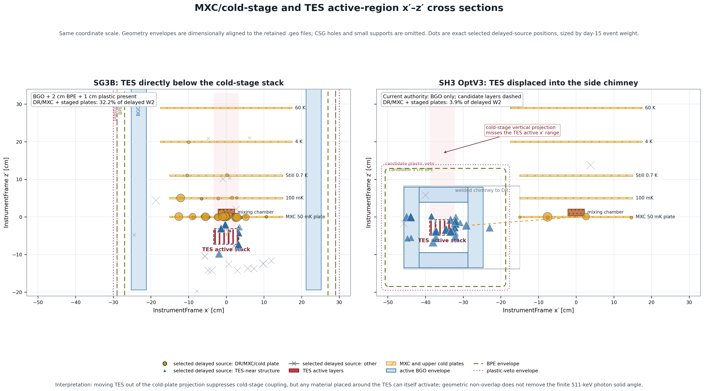

# M05NEW：MXC/冷盘几何与外置 plastic/BPE 判断

## 可直接用于论文的结论

建议保留 `SG3B 基线 -> 本底/空间耦合诊断 -> SH3 偏轴 TES -> 匹配灵敏度`
这条逻辑，但只用一个紧凑剖面和一段文字，不展开成新的优化百科。SG3B 的 TES 直接位于
MXC/分级冷盘投影下方；SH3 OptV3 把 TES 横向移入 chimney。精确 selected-event 回连中，
`DR/MXC + staged cold plates` 对 delayed W2 的贡献占比从 SG3B 的 `32.18%` 降至
SH3 的 `3.92%`。这说明偏轴布局显著减弱冷盘耦合，但不是把活化光子几何概率降为零；
TES 附近新增的屏蔽/支撑材料本身仍可能活化并向 TES 提供有限立体角。

建议图注：**SG3B 与 SH3 OptV3 的 InstrumentFrame `x'-z'` 同尺度工程剖面。**
SG3B 的 TES 活跃层位于 MXC/分级冷盘投影下方；SH3 将 TES 横向移入侧 chimney，冷盘
投影不再覆盖 TES 的 `x'` 范围。符号为精确 selected delayed-source 位置，大小按 day-15
事件权重；`DR/MXC + staged cold plates` 的 delayed-W2 占比由 `32.18%` 降至 `3.92%`。
轮廓按保留 `.geo` 尺寸对齐，省略 CSG 孔和小支撑，不是完整 CAD 图。

## 1. 源初正电子还能否由外置塑料层否决？

不能把它当成当前主要杠杆。OptV3 corrected-keV、W2 最终 cut-flow 中，prompt
源初正电子为 `0 cps`；与源初正电子相关的 delayed 分量只有
`2.7015e-6 cps`，占 direct-final `0.0287%`。当前 prompt-final 全部归在源初 gamma。
因此外置塑料即使对穿越它的带电粒子达到理想效率，也没有足够的源初正电子残余可删。

它也难以否决在冷盘、Cu 支撑或 Bi/BGO 内部产生并就地停止的二级正电子：真正传播到 TES
的是湮没光子，而不是必然穿越外层塑料的正电子。SG3B 的详细 lineage 已出现这种路径：
内部成对产生/湮没事件可以在 plastic 与 BGO 均无能量沉积时进入 511 keV 窗。因此不恢复
旧稿中“plastic positron veto 是主要改进”的表述。

## 2. 至多 5 cm BPE 对当前中子是否有较大收益？

方向上有有限正收益，幅度上不足以达到用户设定的“大收益”。当前 n-induced delayed 为
`7.5385e-4 cps`，占 direct-final `8.0037%`；prompt 源初中子最终为 `0 cps`。
在信号和其他本底完全不变的最乐观上限中，即使 BPE 删除全部 n-induced delayed，
20 d Gaussian 3σ `Fmin` 也只从 `2.22937e-5` 降到 `2.13829e-5`。达到
`1.5e-5` 则要求总成熟本底降低 `54.729%`；甚至理想删除全部 delayed，本底受 prompt gamma
限制，`Fmin` 仍为 `1.74854e-5`。

项目已有 corrected-keV、100,000-history 的 2 cm/5 wt% BPE 边界诊断：进入 BPE 的
primaries 中 `67.55%` 仍到达内边界；1--10 MeV 和 `>=39 MeV` 的透射分别为
`76.09%`、`85.55%`。说明 2 cm 对慢中子吸收明显，但对当前 MeV/高能尾主要是部分慢化。
Cu-61/62/64 的直接 reaction-current indices 为 `0.885/0.842/0.897`，中心值均有利，
没有观察到“BPE 直接增加 Cu 活化”的证据；Cu-64 约 10% 的统计不确定度仍允许中性效果。

若以后做工程 A/B，BPE 应保持在 BGO 外侧。这样慢化和含硼俘获尽量发生在外部，BGO 仍
位于俘获次级粒子/光子与 TES 之间。薄层或置于内侧的慢化材料确有把较低能中子泄入 Cu/Al、
增加俘获活化的机制风险，但这是未来隔离 A/B 要检验的边界，不是当前 2 cm 数据已观察到的
负效应。M05 投稿不需要为此启动新运输，也不把 5 cm BPE 写成已证明的优化。

## 采用决定

- 保留 SG3B 到 SH3 的几何因果逻辑和本剖面图。
- 不恢复外置 plastic/BPE 为 M05 主结构或主性能结论。
- 正文最多一句说明：外置 BPE 对中子诱发活化可能有次级收益，但当前可寻址分量上限不足以
  把 `Fmin` 推到 `1.5e-5`；外置塑料没有当前源初正电子残余可供主要否决。
- 数值引用 R24；2 cm corrected-keV BPE 机制诊断引用 R25。
