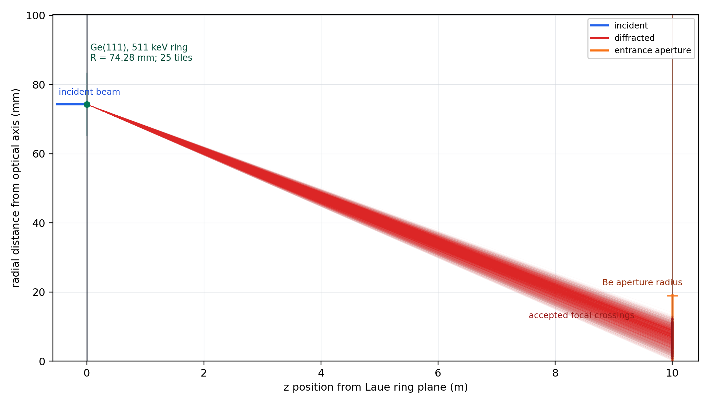
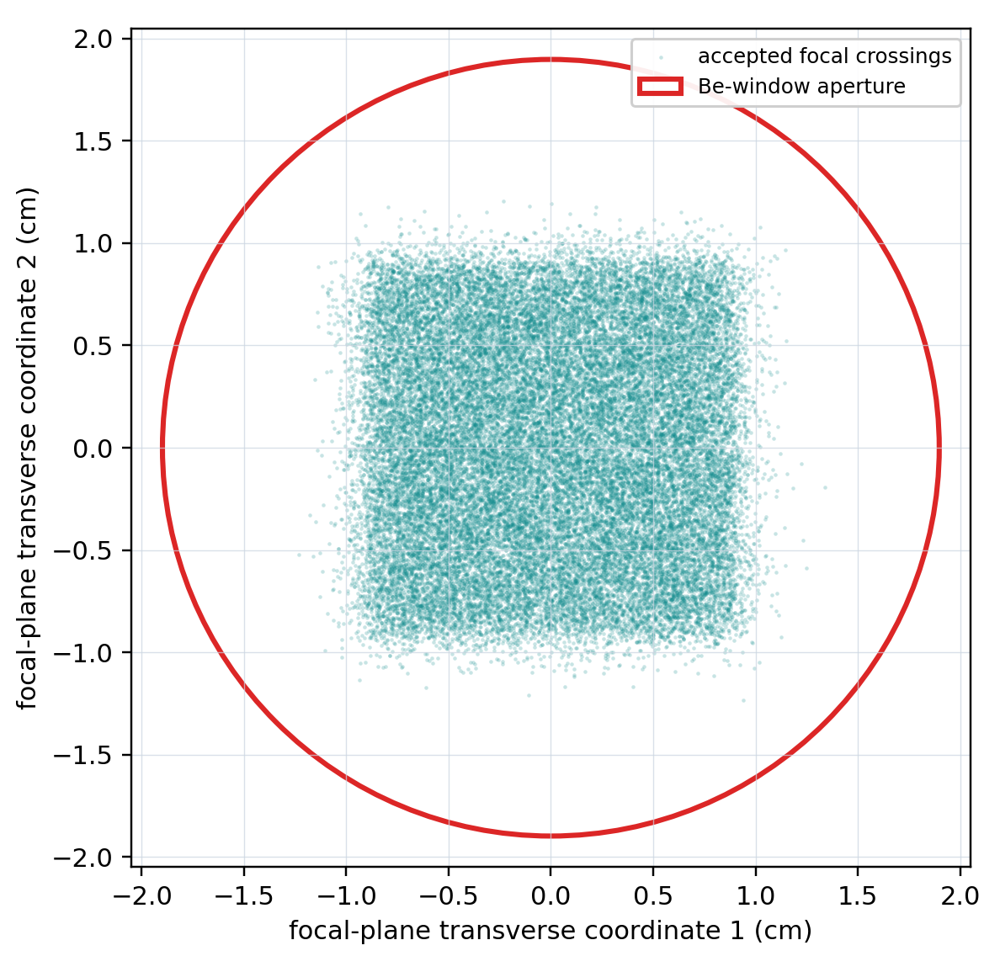
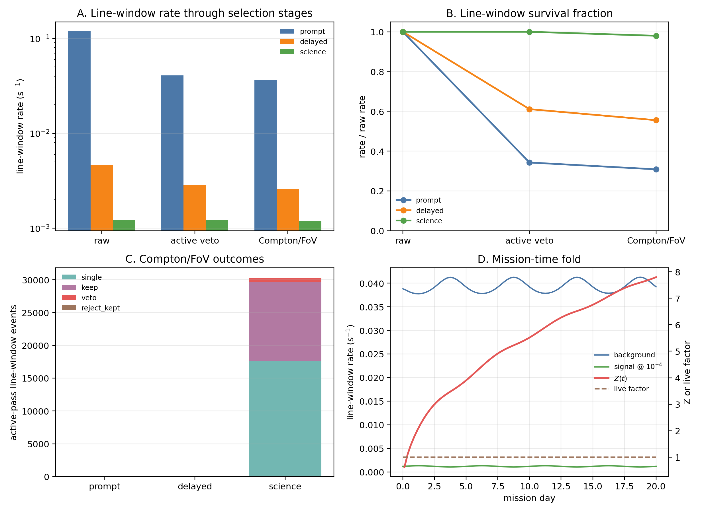

# Detector-coupled Monte Carlo estimate of background and unresolved-line sensitivity for a balloon-borne 511 keV Laue-lens TES telescope

> Review packet generated from `balloon511_nima_draft_en.tex`. Equations and complex tables are intentionally preserved close to LaTeX.

## Abstract

\begin{abstract} The Galactic 511 keV line is the characteristic signature of electron--positron annihilation, but pointed measurements from balloon altitude are limited by atmospheric gamma rays, particle-induced instrumental background, and delayed radioactivation. We present a detector-coupled Monte Carlo estimate for a balloon-borne telescope combining a 10 m Ge(111) Laue lens with a transition-edge-sensor (TES) microcalorimeter focal plane. Focused source photons, prompt atmospheric particles and photons, and delayed radioactive decays are transported through a common detector/cryostat proxy mass model and subjected to the same event definition, including a CsI anticoincidence selection, a topology/field-of-view consistency test, and a $510.58$--$511.42 keV$ line window. Delayed decays are sampled from radionuclide-production coordinates recorded during activation transport. For a monochromatic point source with reference flux $10^{-4}\phcms$, the selected day-15 background and signal rates are $3.92x10^{-2} s^{-1}$ and $1.19x10^{-3} s^{-1}$, respectively; prompt atmospheric events account for about 93% of the selected background. Under the adopted synthetic 20 d trajectory and continuous on-source exposure, the statistical counting metric gives $Z_{20d}=7.80$, a net $3\sigma$ on-source exposure of 2.51 d, and a 20 d $3\sigma$ flux threshold of $3.85x10^{-5}\phcms$. These values are statistical sensitivities for an unresolved line and the present reference mass model; they do not yet include a full-payload prompt-background model, diffuse-sky foregrounds, or systematic uncertainties in the atmospheric field, detector response, activation calculation, and background estimation.

Gamma-ray instrumentation \sep 511 keV annihilation line \sep transition-edge sensors \sep Laue lens \sep balloon-borne telescope \sep Monte Carlo background simulation \sep activation background

## Introduction

The 511 keV gamma-ray line is the characteristic spectroscopic signature of electron--positron annihilation in the Galaxy. After positrons are produced and slow down in the interstellar medium, they annihilate either directly with electrons, producing two photons near 511 keV, or through positronium formation, producing the 511 keV line together with a three-photon continuum below the line. This radiative complex probes positron production, propagation, thermalization, and annihilation conditions [Prantzos2011,Jean2006]. The line was first reported from the Galactic-center direction by balloon-borne experiments and later identified unambiguously with high-resolution Ge detectors as positron-annihilation radiation [Prantzos2011]. The observed Galactic flux implies a positron annihilation rate of order $10^{43}\,\mathrm{e^+\,s^{-1}}$, making the origin of these positrons a long-standing problem in MeV gamma-ray astronomy [Prantzos2011,Kierans2020].

The unresolved source population cannot be inferred from source inventories alone. Candidate channels include $\beta^+$ decay of radioisotopes from stellar explosions and novae, pair creation in compact objects, cosmic-ray interactions, and possible non-standard particle channels [Prantzos2011,Siegert2016AA,Yoneda2025]. The observed annihilation morphology also depends on positron propagation before thermalization and annihilation. Spectroscopy constrains the annihilation medium through the line centroid, line width, and positronium fraction, while continuum limits above 511 keV constrain the injection energy [Prantzos2011,Jean2006,Siegert2019Kinematics]. The observables that would most directly separate source scenarios, including compact-source content, small-scale structure, velocity shifts, and spatially resolved line broadening, remain limited by instrumental sensitivity, angular resolution, and background systematics.

The current observational picture has been shaped by OSSE/CGRO, INTEGRAL/SPI, and COSI. INTEGRAL/SPI established a bright bulge-like component and fainter disk emission, with the detailed bulge/disk decomposition depending on the adopted sky model and instrumental-background treatment [Siegert2016AA,Yoneda2025]. Recent long-exposure SPI analyses recover the central, broad-bulge, and disk structures and suggest marginal additional structures associated with massive-star regions [Yoneda2025]. COSI provided an independent balloon measurement from a 46-d super-pressure-balloon flight, detecting the Galactic 511 keV signal with Compton imaging and finding that the emission is broader than a single point source [Kierans2020,Siegert2020COSI]. Together, these results show that MeV line measurements are limited by weak celestial signals and strong, time-dependent atmospheric and instrumental backgrounds.

Wide-field Compton telescopes are essential for mapping the large-scale 511 keV sky. A complementary strategy is to use a pointed telescope that concentrates 511 keV photons onto a small, high-resolution focal plane. Such a system tests a narrower question: whether a known direction contains compact line emission from an unresolved source, a bright central core, or a transient pair-plasma episode. Compact-source upper-limit studies with INTEGRAL set the relevant flux scale, and the annihilation-related interpretation proposed for the 2015 outburst of V404 Cygni illustrates why targeted follow-up remains relevant, while requiring caution from independent broadband analyses [DeCesare2011,Siegert2016V404,Roques2015]. A focused payload therefore does not replace wide-field Compton missions; it addresses a different observable in a smaller field of view.

The 511-CAM concept follows this route by combining gamma-ray concentrating optics with stacked transition-edge-sensor microcalorimeter arrays [Shirazi2023]. Its relevant capability is the combination of photon concentration and sub-keV calorimetric energy resolution, two properties rarely available together at MeV energies. A projected 511 keV detector-assembly resolution of a few $10^2$ eV FWHM corresponds to a velocity scale of a few $10^2\,\mathrm{km\,s^{-1}}$ and could enable velocity-shift or line-broadening measurements in favorable cases [Shirazi2023]. Event topology also enters the selection. Single-pixel photoelectric events provide direct calorimetric spectroscopy, while multi-pixel events can be checked against Compton kinematics and rejected if inconsistent with photons arriving through the focusing optics.

The main technical limit is background. Balloon-borne gamma-ray spectrometers operate in a strong radiation environment and are necessarily background dominated. Classical studies of balloon-borne Ge spectrometers identify atmospheric-neutron scattering, atmospheric and cosmic gamma-ray aperture flux, beta decays of activation products, and shield leakage as major background components; they also emphasize minimizing passive material near the detector and lowering effective shield thresholds where possible [Gehrels1985]. For a 511 keV line payload, this limit is more direct because the science signal lies at the same energy as strong atmospheric and instrumental annihilation features. A credible sensitivity estimate therefore requires a detector-coupled model of the optics, entrance windows, cryostat, passive material, active shield, prompt atmospheric components, and delayed activation.

Detailed Monte Carlo mass modeling is the standard route to such estimates. The INTEGRAL/SPI response production required a high-fidelity mass model, ground- and in-flight-calibration comparisons, and a practical separation between imaging response and redistribution response to control computing and storage costs [Sturner2003]. Modern MeV mission studies, including AMEGO and COSI, similarly rely on Geant4/MEGAlib-based simulations to calculate response, background, event reconstruction, and sensitivity [Agostinelli2003,Allison2016,Zoglauer2006,Caputo2017,Karwin2023,Gallego2025Balloon,Gallego2025,Beechert2022,Sleator2019,Ciabattoni2025ACS]. The same philosophy is adopted here, but applied to a narrower and more demanding target: a balloon-borne, focused, narrow-line 511 keV telescope with a TES focal plane. Because the study is simulation based, the transport code is not treated as evidence by itself. The rate result is tied to explicit geometry and source normalizations, tracked focal-plane crossings, recorded activation-production positions, common detector-level selections, and downstream checks.

We evaluate that payload at the selected-rate level. The simulation chain starts from a Ge(111) Laue-lens source model at 511 keV and transports focused photons through the detector entrance window into an engineering detector/cryostat mass model. The modeled assembly includes the TES focal plane, staged thermal windows, a Be entrance window, Cu/W passive shielding, cryogenic service proxies, and an active CsI shield. The background chain includes prompt atmospheric components, activation buildup, production-position-sampled delayed-source transport, active-shield vetoes, topology/field-of-view consistency selections, a narrow 511 keV line window, mission-time rate evolution, and counting-significance estimates. The output is a selected-rate calculation in which signal and background pass through the same detector-coupled selection definitions, rather than an isolated effective-area estimate.

The remainder of the paper is organized as follows. Section sec:requirements summarizes the science-driven instrument requirements. Section sec:workflow describes the simulation chain. Sections sec:geometry--sec:selection describe the detector geometry, optics bridge, background model, and event selections. Section sec:results presents the sensitivity, convergence, and background-composition results. Section sec:discussion discusses interpretation, limitations, and remaining validation steps. Section sec:conclusions summarizes the main conclusions.

## Science and instrument requirements

The instrument considered here is optimized for a pointed, narrow-line measurement rather than all-sky imaging. The primary science case is a long-duration balloon search for compact 511 keV emission at photon fluxes of order $10^{-4}\phcms$ or below. This flux scale is used here as a design target for bright central-core, compact-source, and transient pair-plasma scenarios while remaining complementary to wide-field Compton surveys.

The requirements are stated at the level needed for the present simulation, not as final flight-system specifications. They define what the model must preserve for a credible selected-rate estimate: the source flux normalization, the focused entrance phase space, the narrow line-window response, and the same detector selection for signal and background. This distinction is retained because several quantities, including the TES energy response and final cryostat layout, remain design assumptions or engineering proxies.

Four requirements follow. First, the telescope must concentrate 511 keV photons so that a small focal plane can be used without sacrificing collecting area. Second, the focal-plane response must support a sub-keV analysis window so that the line-window background scales with a narrow spectral interval rather than a broad MeV-band continuum. Third, the detector and shield model must suppress atmospheric, activation, and side-entry backgrounds while explicitly accounting for passive material near the TES absorbers. Fourth, the simulation chain must treat prompt background, delayed activation, focused signal, vetoes, event topology, and mission-time variation consistently. Table tab:requirements_traceability gives a compact traceability summary; detailed workflow tables are kept outside the main text.

**Table: Compact traceability summary for the reference unresolved-line calculation.**

```latex
\begin{table}[t]
\centering
\caption{Compact traceability summary for the reference unresolved-line calculation.}
\label{tab:requirements_traceability}
\footnotesize
\begin{tabular}{@{}p{0.25\linewidth}p{0.32\linewidth}p{0.33\linewidth}@{}}
\toprule
Science driver & Model requirement & Present treatment \\
\midrule
Compact 511 keV targets & Concentrate photons onto a small detector & 10 m Ge(111) Laue optics with tracked focal-plane photons replayed through the detector model \\
Unresolved-line spectroscopy & Preserve the narrow line response and photon-flux normalization & $510.58$--$511.42\keV$ event-energy window and selected effective area from the same detector selection \\
Balloon backgrounds & Apply common selection to signal, prompt, and delayed streams & CsI anticoincidence, topology/field-of-view consistency, and production-position-sampled delayed decays \\
Reference-exposure sensitivity & Fold selected rates through the adopted exposure model & Synthetic 20 d trajectory with continuous on-source exposure; no target ephemeris or duty-cycle loss \\
\bottomrule
\end{tabular}
```

These requirements also set the interpretation of the results. The reported threshold is a reference-exposure statistical sensitivity for an unresolved line because it depends only on energy selection, vetoing, topology/field-of-view consistency, and the mission-time rate fold. Focused-spot and annular secondary analyses test spatial-analysis boundaries, but they do not replace the line-window requirement until a final spatial-spectral likelihood and background-nuisance treatment are in place.

## Simulation workflow

Figure fig:workflow summarizes the workflow. The calculation is divided into geometry definition, prompt and buildup transport, delayed-source construction, focused-optics transport, detector-coupled signal replay, detector event selection, mission-time rate folding, source-case normalization, and cumulative significance evaluation. The present manuscript uses production-position-sampled delayed decays as the primary delayed-source representation: delayed decays are sampled from recorded radioactive-production positions instead of being redistributed into an axisymmetric radial profile.

```latex
\begin{figure}[t]
\centering
\newcommand{\flowbox}[1]{\fbox{\begin{minipage}{0.17\linewidth}\centering\scriptsize #1\end{minipage}}}
\flowbox{Geometry\\model}
\(\rightarrow\)
\flowbox{Prompt and activation\\transport}
\(\rightarrow\)
\flowbox{Delayed\\activity source}
\(\rightarrow\)
\flowbox{Production-position\\decay transport}

\vspace{0.8ex}
\(\downarrow\)
\vspace{0.8ex}

\flowbox{Laue\\optics}
\(\rightarrow\)
\flowbox{Optics-detector\\coupling}
\(\rightarrow\)
\flowbox{Detector\\selection}
\(\rightarrow\)
\flowbox{Time fold and\\significance}
\caption{Simulation chain used in this work. The focused signal and all
background streams are evaluated in the same detector-response and event-selection
space before mission-time significance is calculated.}
\label{fig:workflow}
```

The primary rate calculation combines prompt and activation-buildup transport, a fixed day-15 radionuclide population, sampled equal-activity point sources at recorded production positions, and downstream propagation through the detector response, event selection, and significance calculation.

Each layer has a defined input, a physical or statistical operation, an output consumed by later layers, and an interpretation boundary. Geometry definition fixes the mass model and coordinate policy but does not produce a rate. Prompt transport and activation transport define direct atmospheric backgrounds and isotope-production histories. The delayed-source layer converts those histories into a fixed day-15 radioactive population and transports sampled production-position decays. The optical Monte Carlo is signal-only: it supplies the Laue-lens effective area and tracked focused phase space, while the optics-detector coupling and detector-response layers convert that phase space into a detector-coupled point-source response. Mission-time folding and cumulative counting then convert selected rates into a reference-exposure statistical sensitivity.

The numerical hierarchy used below follows the same logic. Day-15 selected

rates are quoted after the focused signal stream has been scaled by the 10 m

Ge(111) effective area and the reference atmospheric transmission.

Mission-mean rates are quoted from the time-dependent fold, and the primary

$Z$, net $3\sigma$ exposure, and flux thresholds are quoted from the cumulative

significance calculation. Production-position sampling checks are interpreted

only after the sampled source has been transported through the same detector

selection and significance chain. This separation avoids mixing unit-injection

rates, day-15 direct expectations, and mission-folded sensitivities in a single

result.

## Detector and cryostat mass model

The detector model is an engineering Geant4/MEGAlib proxy mass model for a balloon-borne TES focal-plane assembly mounted at the cold end of a compact dilution-refrigerator (DR) stack [Shirazi2023,Gottardi2021TESReview]. It is not a final flight CAD model, and it is not intended to reproduce the microfabricated TES layers, detailed wiring, readout layout, or every cryogenic service component. It also does not include the full gondola, optical bench, lens support structure, electronics, pressure vessels, or diffuse celestial fields. Instead, the model preserves the detector/cryostat material columns and local apertures that are first-order for 511 keV transmission, scattering, activation, active-shield vetoing, and event topology. The baseline detector/cryostat geometry therefore contains the TES absorber stack, substrate and window proxies, the side Be entrance window, passive shield/collimator material, cryogenic service-mass proxies, and a segmented CsI active anticoincidence shield. Figure fig:mass_model shows two-dimensional views of the proxy mass model, and Table tab:geometry lists the detector and analysis parameters fixed before the rate calculation.

The DR and service hardware are represented at proxy-mass level. The model keeps the physical order of the main temperature stages: the TES module is placed at the 50 mK/MXC end, followed by cold-plate and heat-exchanger proxies for the CP, still, 4 K, 60 K, and 300 K service regions. Al shells and windows represent staged radiation shields and the vacuum jacket. Support structures, capillaries, cable bundles, readout boxes, and other services are not laid out as flight-ready parts; they are included as local service-mass proxies where they can contribute scattering or activation. This simplification keeps the detector bay, beam aperture, and upper service tower in their correct spatial relationship without treating the model as a mechanical design.

The TES focal plane is represented by the gamma-ray absorber array plus a parameterized calorimeter response, rather than by a full microfabricated TES/readout layout [Zhang2022TESGamma]. In the present detector concept the TES thermometer film is an AlMn layer of order $200\,nm$ thickness, whereas the gamma-ray absorber is a millimetre-scale metal structure. For the non-thermal detector-background simulation in this paper, 511 keV stopping, Compton scattering, and activation are therefore governed mainly by the absorber and nearby support mass. The explicit sensitive volume is six layers of 376 Ta absorber pixels, or $2256$ pixels in total. Each pixel is a $1.5x1.5x3.0\,mm^3$ absorber in the side-entry coordinate system, with the $3.0\,mm$ depth aligned to the focused beam. TES-film, wiring, and readout details enter through the assumed energy response and through service-mass proxies rather than as explicit interaction volumes. The selected-rate model treats the reconstructed summed TES energy with a single Gaussian event-energy response proxy, $\sigma=0.14 keV$, and does not model independent per-pixel smearing. Gain drift, non-Gaussian tails, pile-up, saturation, and response-parameter scans are not included, so the quoted thresholds should be read within this idealized response envelope. The analysis window is fixed separately as $W_{511}=510.58$--$511.42 keV$. The detector efficiency is not imposed as a standalone scalar in this mass-model section; it is generated by Geant4 transport through the absorber/shield geometry and by the downstream event-selection and signal-normalization chain.

The local side-entry geometry points the Be window $45^\circ$ upward in the zenith-frame source coordinates, with an instrument-frame rotation of $0,45,0$ degrees. The side aperture passes through the CsI shield and passive package and is bounded by a 2 cm-thick W square-bore sleeve. This sleeve is an aperture and leakage-suppression proxy, not a pixel-matched 376-hole collimator. The outer package uses an Al mechanical shell, Cu/W graded passive liners in the detector bay, a W bottom plate, and segmented side, bottom, and top CsI volumes. Low-Z Al foils and a $150\,\mum$ Be vacuum window are placed on the side beam line to retain a transparent 511 keV entrance path while keeping cryogenic-window material in the transport model.

The CsI scintillator volumes are used as the mass-model proxy for the active anticoincidence layer. They enter the simulation as materials for transport and activation, and as shield volumes whose deposited energy is evaluated in post-processing. Candidate events are grouped on a common Poisson time axis and vetoed if the summed CsI shield energy in the coincidence window exceeds the analysis threshold. For the baseline CsI configuration the analysis veto threshold is $50 keV$ and the coincidence window is $1\,\mus$. This keeps the veto definition common to prompt, delayed, and focused-science streams and prevents production-time trigger flags from becoming the quantitative rate definition. The geometry-definition stage fixes the material and coordinate choices before rate calculations are made; it does not by itself define a sensitivity.


*Two-dimensional views of the detector/cryostat proxy mass model. Top: X--Z overview of the DR tower, detector bay, active shield, and side-entry beam path. Bottom: detector-bay detail showing the TES absorber stack, open beam region, and off-axis Cu thermal links.*

**Table: Key detector and analysis parameters used for the reference calculation.**

```latex
\begin{table}[t]
\centering
\caption{Key detector and analysis parameters used for the reference calculation.}
\label{tab:geometry}
\begin{tabular}{p{0.36\linewidth}p{0.56\linewidth}}
\toprule
Parameter & Value or policy \\
\midrule
Detector concept & TES microcalorimeter focal plane \\
TES pixel copies & $6\times376=2256$ \\
TES absorber proxy & Ta pixels, $1.5\times1.5\times3.0\,\mathrm{mm^3}$ each \\
TES energy-response proxy & Single Gaussian event-energy proxy, $\sigma=0.14\keV$; independent per-pixel smearing not modeled \\
Detector efficiency & Geant4 transport plus downstream selected-rate normalization; no standalone scalar efficiency is imposed here \\
Active shield & Segmented CsI, post-processing veto \\
CsI veto threshold & $50\keV$ summed shield energy \\
Entrance-window stack & staged Al foils plus $150\,\mu\mathrm{m}$ Be side window \\
Passive shielding/collimation & Cu/W proxy liners, W bottom plate, and 2 cm W side sleeve \\
DR/service proxies & MXC/CP/still/4 K/60 K/300 K stage order plus local structural, cabling, and readout service-mass proxies \\
Pointing & Local side window tilted $45^\circ$ upward \\
Detector trigger/veto definition & Common detector-level post-processing selection \\
Coincidence window & $1\,\mu\mathrm{s}$ \\
Line window $\wii$ & $510.58$--$511.42\keV$ \\
Reference point-source flux $\fzero$ & $10^{-4}\phcms$ \\
\bottomrule
\end{tabular}
```

## Laue optics and detector-coupled signal replay

The signal model follows the standard Laue-lens approach in which mosaic crystals diffract incident gamma rays in transmission and concentrate them onto a small focal detector [Barriere2009Laue,Barriere2011LauePrototype]. This is the same optical principle adopted in earlier focused gamma-ray telescope studies, where detector response must be evaluated together with the focused phase space rather than from lens effective area alone [Weidenspointner2006MAX]. For the present 511 keV TES concept [Shirazi2023], the baseline optical configuration is a single-energy Ge(111) Laue ring with focal length $10\,m$, 25 square tiles of 18 mm side length, 30 arcsec mosaic FWHM, and active Ge mass $0.441\,kg$. External XOP/CRYSTAL rocking-curve maps [SanchezDelRio2011XOP] set the Ge(111) diffraction probability and angular response. The effective-area normalization is the ring geometric area multiplied by the simulated fraction of diffracted photons that emerge through the detector entrance aperture, giving $A_{eff}(511 keV)=20.1\,cm^2$.

The optical simulation is used as a source generator rather than as a standalone effective-area calculation. During transport, gamma rays that cross the nominal focal plane are recorded with their energy, position, direction, and production history. Only tracked diffracted photons that fall within the Be entrance-window aperture are passed downstream; analytic spot projections are retained only as diagnostics. This preserves the attenuation and scattering that occur while the diffracted photon exits the Ge crystal.

Figures fig:optics_transport_schematic and fig:optics_focal_spot show the two levels of the optics-detector coupling: the radial optical constraint from the configured Laue ring to the focal plane, and the transverse distribution injected into the detector model.



*Simulation-derived radial--$z$ view of the 511 keV Laue signal source. The diffracted fan terminates on tracked focal-plane crossings that satisfy the Be entrance-aperture gate.*



*Tracked transverse focal-plane positions, $(x_{\rm fp},y_{\rm fp})$, accepted by the Be entrance aperture and used for detector replay. The red circle marks the Be-window aperture.*

The accepted focal-plane photons are transformed into the local side-entry detector coordinate system and replayed through the detector/cryostat mass model. This keeps the simulated entrance position and direction distribution, rather than replacing the optical calculation with an analytic focal spot. The focal-plane crossing table used here is therefore a transported optical-signal input: it records gamma rays from the 511 keV source simulation that cross the focal plane, not particles produced by atmospheric or cosmic-ray interactions in the upstream lens hardware.

An auxiliary upstream-hardware calculation was run to test that this boundary can be treated by the same Geant4/MEGAlib background machinery when needed. The calculation places an equal-volume and equal-mass Ge proxy for the active Laue crystals at the 10 m upstream lens position. The proxy corresponds to 25 square Ge tiles of 18 mm side length and about 10.2 mm thickness, giving active Ge volume $82.8\,cm^3$ and mass $0.441\,kg$. The atmospheric far-field source surface is derived from the combined detector-plus-lens enclosing radius: the 10 m lens center plus the active-crystal volume bound gives about $1009\,cm$, and the transport source surface is rounded upward to a radius of $1060\,cm$ inside a $2500\,cm$ world half-size. Production prompt and activation-production transports were run for the proxy with the same eight EXPACS/PARMA particle families ($\gamma$, $n$, $e^\pm$, $p$, $\alpha$, and $\mu^\pm$) used in the detector-background chain. These runs define the full-particle transport and isotope-production boundary for the upstream mass proxy. The delayed component from the active-Ge proxy is isolated from the combined isotope-production records and replayed as a recorded-position decay source through the same detector-level selection; its selected-rate consequence is reported in Section subsec:upstream_optics_background.

For the focused point-source response, $F_0=10^{-4}\phcms$ denotes the reference incident 511 keV photon flux. The quoted line-window signal response, $1.19x10^{-3} s^{-1}$, is the selected $W_{511}$ signal rate at that flux after detector transport, the reference atmospheric-transmission factor, and detector-level event selection. The corresponding selected effective area is $A_{sel}=S_{W_{511}}/F_0=11.9\,cm^2$. This reference normalization should be read as the baseline pointing case, not as a universal atmospheric transmission for all balloon pointings. Low-elevation or long-slant observations, including Galactic-center observations from northern mid-latitude balloon trajectories, should use a slant-column transmission model; such slant-column calculations remain boundary checks rather than replacements for the quoted reference-exposure result.

## Prompt atmospheric and delayed-activation source model

### Prompt atmospheric source

The background source model is separated into prompt atmospheric transport and delayed activation so that source generation does not absorb assumptions that belong to detector selection. The prompt atmospheric field is derived from EXPACS/PARMA. PARMA3.0 is an analytical model parameterized from PHITS atmospheric-shower calculations and benchmarked for terrestrial cosmic-ray fields, and EXPACS is its public tabulation/software interface [Sato2015EXPACS,Sato2016PARMA4]. PHITS supplies the underlying particle-transport calculation for cosmic-ray interactions in the atmosphere: primary cosmic rays interact with air nuclei, secondary hadrons, leptons, photons, and neutrons are transported through the atmospheric column, and the resulting particle fluences are parameterized by altitude, geomagnetic cutoff, solar modulation, energy, and direction. In this work EXPACS/PARMA provides the differential incident particle flux as a function of particle species, kinetic energy, zenith angle, geographic position, altitude, geomagnetic cutoff rigidity, and solar modulation. It is used only to construct the external radiation fields; detector response, vetoing, topology selection, and mission-time counting are applied later. The reference source definitions use latitude $34^\circ$, longitude $100^\circ$, altitude $38\,km$, vertical cutoff rigidity $R_c=11.6\,GV$, and the 2025-08-31 solar condition corresponding to $W=118.3$.

The prompt source includes photons, neutrons, electrons, positrons, protons, alpha particles, negative muons, and positive muons. For each particle family, the EXPACS/PARMA differential spectrum is converted into a MEGAlib far-field area source over the full zenith range $\theta=0^\circ$--$180^\circ$ and full azimuth range $\phi=0^\circ$--$360^\circ$. The zenith dependence is represented by 20 differential equal-$\mu$ angular bins, where $\mu=\cos\theta$ and each bin subtends $\Delta\Omega=0.6283185307\,sr$. The first ten bins cover down-going particles ($0^\circ\leq\theta\leq90^\circ$), and the last ten bins cover up-going or albedo-like particles ($90^\circ\leq\theta\leq180^\circ$). Both hemispheres are retained in both the prompt transport and the activation-production transport, so upward albedo particles are not discarded at source construction.

Figure fig:expacs_fullsphere_flux shows the resulting full-sphere flux field.

![EXPACS/PARMA full-sphere atmospheric flux field used to generate the prompt and activation-production transport inputs. Left: energy- and solid-angle-integrated fluxes for the eight transported particle families, separated into down-going and up-going hemispheres. Right: bin-integrated flux in the 20 equal-$\mu$ differential zenith bins used by the MEGAlib far-field source. The plot is generated from the source-definition inputs for latitude $34^\circ$, longitude $100^\circ$, altitude $38\,km$, $R_c=11.6\,GV$, and $W=118.3$.](paper_source_figure_table/fig_expacs_fullsphere_flux.png)

*EXPACS/PARMA full-sphere atmospheric flux field used to generate the prompt and activation-production transport inputs. Left: energy- and solid-angle-integrated fluxes for the eight transported particle families, separated into down-going and up-going hemispheres. Right: bin-integrated flux in the 20 equal-$\mu$ differential zenith bins used by the MEGAlib far-field source. The plot is generated from the source-definition inputs for latitude $34^\circ$, longitude $100^\circ$, altitude $38\,km$, $R_c=11.6\,GV$, and $W=118.3$.*

The integrated source-plane fluxes are approximately $4.80$, $0.462$, $0.199$, $0.117$, $0.112$, $0.0115$, $0.0050$, and $0.0056\,\mathrm{cm^{-2}\,s^{-1}}$ for $\gamma$, $n$, $e^-$, $e^+$, $p$, $\alpha$, $\mu^-$, and $\mu^+$, respectively. The non-photon components therefore carry about $0.91\,\mathrm{cm^{-2}\,s^{-1}}$, or 16% of the total full-sphere source-plane flux. To keep their detector and activation statistics from being limited by strict flux-proportional event counts, the non-photon particle families are generated with replicated Monte Carlo samples and then de-weighted in the rate normalization. These particles are transported through the detector/cryostat mass model with Geant4/MEGAlib [Agostinelli2003,Zoglauer2006]. The prompt run and the activation-production run each generated about $2.52x10^7$ incident primary particles. Each particle species is normalized with its own transported exposure using

```latex
\begin{equation}
\begin{equation}
  r_{\mathrm{event},j}=\left(\sum_i \mathcal{T}_{ij}\right)^{-1},
\end{equation}
```

where $\mathcal{T}_{ij}$ is the transported exposure of subsample $i$ for particle species $j$. This per-species normalization is required because photon and non-photon atmospheric streams have different sampling and exposure structures. The normalization check enforces $r_{event,j}\sum_i\mathcal{T}_{ij}=1$ for each particle species, so over-sampling changes the Monte Carlo variance but not the expected physical rate.

### Delayed activation source

The activation-production stream is not counted as an immediate detector background. Instead, it records the isotope, material volume, and production position of radioactive products. These records are converted into a fixed day-15 radioactive population using production--decay buildup equations and ground-state half-life corrections checked against NUBASE2020 [Kondev2021NUBASE]. For isotope $k$,

```latex
\begin{equation}
\begin{equation}
  A_k(t_{\mathrm{flight}}) = R_k\left[1-\exp\left(-\lambda_k t_{\mathrm{flight}}\right)\right],
  \qquad \lambda_k = \frac{\ln 2}{t_{1/2,k}},
\end{equation}
```

where $R_k$ is the production rate inferred from the activation-production transport and $t_{flight}=15\,d$ for the reference day-15 state. The resulting fixed delayed activity used by the reference delayed-source construction is $85.45\,Bq$.

The position information is not obtained from the aggregate isotope store alone. The standard isotope store records the volume name and isotope count, while the production-position-sampled construction also uses a custom hook in the Geant4/MEGAlib stepping-action layer. At the same point where an isotope is stored during activation buildup, the hook writes a production-position record containing the logical volume, pre-step position $(x,y,z)$, isotope identifier $1000Z+A$, excitation energy, time, process, and track ancestry metadata. The fixed day-15 isotope population is then joined to these records by volume, isotope, and excitation state. This gives the delayed source access to the simulated production coordinates rather than only to volume-integrated activities.

Figure fig:delayed_position_distribution shows the resulting delayed-source position distribution after matching radioactive-production positions to the fixed day-15 activity population.

![Production-position-sampled delayed-source distribution constructed from recorded radioactive-isotope production positions. Left: activity-weighted X--Z map of the recorded production positions overlaid on the detector/cryostat proxy geometry. Top middle: activity-weighted X--Y footprint sampled from the same distribution, with the Be aperture and shield envelope shown for scale. Right and bottom: leading production volumes and nuclides after fixed day-15 activity weighting. The activity weights in the matched production-position table sum to $85.45\,Bq$.](paper_source_figure_table/fig_delayed_position_rpip_distribution.png)

*Production-position-sampled delayed-source distribution constructed from recorded radioactive-isotope production positions. Left: activity-weighted X--Z map of the recorded production positions overlaid on the detector/cryostat proxy geometry. Top middle: activity-weighted X--Y footprint sampled from the same distribution, with the Be aperture and shield envelope shown for scale. Right and bottom: leading production volumes and nuclides after fixed day-15 activity weighting. The activity weights in the matched production-position table sum to $85.45\,Bq$.*

The activity-weighted distribution is dominated by CsI shield activation and by $^{128}$I, with smaller contributions from Cu, Al, W, Mg, and Cs isotopes. The figure is a source-construction diagnostic, not a detector-count map; detector response is applied only after the delayed decays are transported through the common geometry and event selection.

The need to preserve production-position information is also testable from the same production table. Delayed decays are emitted locally, so the downstream attenuation, active-shield veto probability, and event topology depend on where the isotope was produced. Charged hadrons and muons have different energy-loss, stopping, and capture histories from neutrons, and therefore need not produce an exchangeable material or coordinate distribution. To quantify this, the weighted production rows were grouped by incident particle family and by material category. For two families $a$ and $b$, we compare the activity-normalized category distributions with

```latex
\begin{equation}
\begin{equation}
  D_{\mathrm{TV}}(a,b) =
  \frac{1}{2}\sum_c \left| f_{a,c} - f_{b,c} \right| ,
\end{equation}
```

where $f_{a,c}$ is the fraction of delayed activity from incident family $a$ produced in material category $c$.

Figure fig:position_sampling_necessity gives the result of this test.

![Production-position sampling diagnostic. The upper panels compare the day-15 weighted production table by incident particle family: material fractions, nuclide mix, and total activity. The lower panels show the recorded X--Z production-position maps for neutron-, proton-, and $\mu^-$-induced products. The distributions are not exchangeable: neutron-induced activity is dominated by CsI and $^{128}$I, while $\mu^-$-induced activity is concentrated in Al/Cu/W-bearing service and shield material and is dominated by Mg/Na/Ne products.](paper_source_figure_table/fig_position_sampling_necessity.png)

*Production-position sampling diagnostic. The upper panels compare the day-15 weighted production table by incident particle family: material fractions, nuclide mix, and total activity. The lower panels show the recorded X--Z production-position maps for neutron-, proton-, and $\mu^-$-induced products. The distributions are not exchangeable: neutron-induced activity is dominated by CsI and $^{128}$I, while $\mu^-$-induced activity is concentrated in Al/Cu/W-bearing service and shield material and is dominated by Mg/Na/Ne products.*

In the fixed day-15 table, the activities are about $82.5\,Bq$ for neutron-induced products, $2.75\,Bq$ for $\mu^-$-induced products, $0.15\,Bq$ for proton-induced products, and $0.022\,Bq$ for $\alpha$-induced products, with smaller $\mu^+$ and $e^+$ contributions. The neutron-induced activity remains dominated by the CsI active shield, while the $\mu^-$ component is qualitatively different: Cu/support material, Al shells, and W-bearing passive material account for 32%, 29%, and 21% of the $\mu^-$-induced activity, respectively. A volume-integrated or axisymmetric radial source could preserve total activity, but it would remove incident-family, material, nuclide, and coordinate correlations. The production-position construction keeps them in the source distribution before detector transport.

The delayed-decay source is launched from sampled production positions rather than from an axisymmetric radial profile. Let rows $j$ in the weighted production table have activity weights $w_j$ with total activity $A=\sum_j w_j$. The production-position approximation draws $M$ production positions with replacement using probabilities $p_j=w_j/A$, and assigns each sampled point source flux $A/M$. The expected activity assigned to row $j$ is therefore

```latex
\begin{equation}
\begin{equation}
  \mathbb{E}\!\left[N_j\frac{A}{M}\right] = M p_j \frac{A}{M} = w_j ,
\end{equation}
```

so the estimator is activity preserving and unbiased for the weighted spatial distribution. Here $M$ denotes the number of equal-activity sampled point sources used to approximate the distribution; it is a sampling size, not the number of physical isotope-production rows. The reference delayed source preserves the total fixed activity at the source-definition level and is replayed through the same detector/cryostat geometry used for the prompt stream. The nominal delayed calculation transported $10^6$ delayed decays; the corresponding Cosima live time is a transport record for the generated decay sequence and is not used as the physical balloon exposure.

Table tab:background_source_model collects the source layers used by the current detector-coupled calculation. It is placed in the source-model section because it defines the incident and delayed radioactive populations before detector vetoes and topology selections are applied.

**Table: Background-source layers used by the current detector-coupled chain. The table defines the source construction only; vetoes, topology selections, and the hard line window are applied later in Section sec:selection.**

```latex
\begin{table}[t]
\centering
\caption{Background-source layers used by the current detector-coupled chain. The table defines the source construction only; vetoes, topology selections, and the hard line window are applied later in Section~\ref{sec:selection}.}
\label{tab:background_source_model}
\begin{tabular}{p{0.22\linewidth}p{0.34\linewidth}p{0.34\linewidth}}
\hline
Layer & Physical role & Current implementation \\
\hline
Prompt atmospheric transport & Direct detector hits from atmospheric secondaries & EXPACS/PARMA full-sphere source definitions at $34^\circ$ latitude, $100^\circ$ longitude, $38\,\mathrm{km}$ altitude, $R_c=11.6\,\mathrm{GV}$, and $W=118.3$; $\gamma$, $n$, $e^\pm$, $p$, $\alpha$, and $\mu^\pm$ over 20 equal-$\mu$ differential zenith bins including both down-going and up-going hemispheres; 25,210,216 generated primaries. \\
Activation production & Radioisotope production and production-position history & Same atmospheric fields transported as a buildup stream, again retaining both hemispheres and all eight particle families; 25,210,216 generated primaries. \\
Fixed delayed population & Radioactive activity after continuous exposure to the adopted day-15 state & Production--decay buildup with NUBASE-checked ground-state half-lives; total fixed activity $85.45\,\mathrm{Bq}$. \\
Production-position decay transport & Delayed decay particles emitted from sampled production locations & Equal-activity sampled point sources from the weighted production table; reference transports use $10^6$ delayed decays per source sampling. \\
\hline
\end{tabular}
```

This production-position representation is not an exhaustive source with one sampled point source for every production row. It is a statistically sampled representation whose adequacy is evaluated downstream in Section subsec:convergence. Source-inventory checks verify activity conservation and source serialization; the selected-rate behavior is evaluated separately after detector transport and event selection.

## Detector event selection and veto definition

The analysis window is

```latex
\begin{equation}
\begin{equation}
  \wii = [510.58,511.42]\keV,
\end{equation}
```

corresponding to $511 keV\pm420\,eV$. This window is matched to a sub-keV TES response assumption and is narrow enough to suppress continuum background while retaining most of the line response.

The quoted flux thresholds therefore apply to a line whose intrinsic width remains small compared with this analysis window after detector response; broader source lines would require convolving the source line profile with the detector response and re-optimizing or widening the analysis window.

The detector selection has two explicitly separated veto layers. First, an

active anticoincidence gate is applied on a common detector time axis. For a

candidate group $c$, formed from event instances separated by no more than

$\tau=1\,\mus$, the TES energy and active-shield energy are

```latex
\begin{equation}
\begin{equation}
  E_{\mathrm{TES}}^{(c)}=\sum_{j\in c}E_{\mathrm{TES},j},\qquad
  E_{\mathrm{sh}}^{(c)}=\sum_{j\in c}E_{\mathrm{sh},j}.
\end{equation}
```

A candidate enters the hard line window if $E_{TES}^{(c)}\in W_{511}$,

and it passes the active shield if

```latex
\begin{equation}
\begin{equation}
  E_{\mathrm{sh}}^{(c)} < E_{\mathrm{veto}}, \qquad E_{\mathrm{veto}}=50\keV
\end{equation}
```

for the baseline CsI configuration. The shield sum is evaluated from the CsI

active-shield volumes in post-processing. Native detector trigger/veto blocks

are present in the geometry description, but the quantitative rate definition is

this common post-processing definition, so prompt, delayed, and focused-signal

streams use the same coincidence window and threshold.

The second layer is a topology/field-of-view consistency test on the TES hits

that survive the active-shield gate. Baseline event classes are kept explicit:

single-site events, valid reconstructed multi-site events, and unreconstructed

multi-site events. Single-pixel TES events are retained as calorimetric line

candidates. For a two-hit event, both possible first-scatter orders are tested

under the assumptions of a single Compton scatter followed by full absorption

in the measured TES hits. For an assumed order with first deposited energy

$E_1$ and remaining scattered-photon energy $E_{sc}$, the kinematic

angle is computed from

```latex
\begin{equation}
\begin{equation}
  \cos\theta_C =
  1 - m_ec^2\left(\frac{1}{E_{\mathrm{sc}}}
  - \frac{1}{E_1+E_{\mathrm{sc}}}\right).
\end{equation}
```

The event is kept if either order gives a physically valid first-scatter cone

that intersects the side Be-window disk. For higher multiplicities the current

implementation enumerates candidate hit orders up to six TES hits, selects the

best sequence using the unweighted Compton sequence residual

```latex
\begin{equation}
\begin{equation}
  Q = \sum_{i=1}^{n-2}
  \left(\cos\theta_{C,i} -
  \hat{\mathbf u}_{i-1,i}\cdot\hat{\mathbf u}_{i,i+1}\right)^2,
\end{equation}
```

and then applies the same first-cone intersection test to the first reconstructed

scatter. If no valid sequence is found, the event is classified as

unreconstructed. Such events are retained in the baseline selected-rate

definition but are not called field-of-view passing. The line-window result

therefore does not gain sensitivity from rejecting ambiguous reconstruction

failures. This policy is not a conservative lower bound on the net sensitivity:

in the current $W_{511}$ sample, a diagnostic alternative that discards the

unreconstructed class would retain $59.2%$ of the focused signal and $66.8%$

of the selected background, reducing the simple $S/\sqrt{B}$ figure to $0.724$

of the baseline value. The baseline selection therefore treats ambiguous

multi-hit events as a reconstruction-model boundary that must be validated, not

as a sensitivity gain from aggressive event rejection.

The detector-level time-axis construction used to validate this veto bookkeeping

is a Poisson superposition of independent streams. For stream $k$ with

event-catalogue rates $r_{kj}$ and total rate $R_k=\sum_j r_{kj}$, a validation

draw uses

```latex
\begin{equation}
\begin{equation}
  N_k\sim \mathrm{Pois}(R_k T),
\end{equation}
```

selects event records with probabilities $r_{kj}/R_k$, assigns uniform times in

$[0,T]$, sorts all streams together, and forms $\tau$-coincidence candidate

groups. This draw tests the grouping and accidental-coincidence bookkeeping;

the mission-time calculation below uses the corresponding expectation values

instead of adding a new random draw to every mission bin.

Figure fig:selection_time_axis summarizes the selected rates after these

veto layers and previews the mission-time fold defined in

Section sec:mission_time.



## Mission-time trajectory fold and significance calculation

After detector selection is fixed, the selected day-15 rates are folded through

a reference mission-time trajectory. This layer is a rate-level correction: no

new Geant4/MEGAlib transport is run in each mission-time bin. The time grid has

81 points from 0 to 20 d with 0.25 d spacing; endpoint points carry half-widths

in the count integration. The trajectory is a synthetic reference profile, not

balloon telemetry. For time-grid point $t_i$ in days,

```latex
\begin{align}
\begin{align}
  h_i &= h_0+\Delta h\sin\!\left[\frac{2\pi(t_i-15)}{5}\right],\\
  \varphi_i &= \varphi_0+\Delta\varphi\sin\!\left[\frac{2\pi(t_i-15)}{7}\right],\\
  \ell_i &= \ell_0+\Delta\ell\sin\!\left[\frac{2\pi(t_i-15)}{9}\right],
\end{align}
```

where $h_0=38.75\,km$, $\Delta h=2.5\,km$,

$\varphi_0=34^\circ$, $\Delta\varphi=0.25^\circ$, $\ell_0=100^\circ$,

and $\Delta\ell=0.25^\circ$. The resulting ranges are

$36.25$--$41.25\,km$ in altitude, $33.75^\circ$--$34.25^\circ$ in

latitude, and $99.75^\circ$--$100.25^\circ$ in longitude.

The atmospheric depth and the 511 keV transmission scale are

```latex
\begin{align}
\begin{align}
  X(h_i) &= X_{38}\exp\!\left[-\frac{h_i-38\,\mathrm{km}}{H}\right],
       & X_{38}&=3.86510\,\mathrm{g\,cm^{-2}},\quad H=6.8\,\mathrm{km},\\
  T_i &= \exp[-\mu_{\mathrm{eff}} X(h_i)],
       & \mu_{\mathrm{eff}}&=-\frac{\ln T_{15}}{X(h_0)},
\end{align}
```

with $T_{15}=0.739$. Thus the focused-science scale is

$f_{atm,i}=T_i/T_{15}$. The prompt atmospheric source scale is

```latex
\begin{align}
\begin{align}
  R_{c,i} &= 11.0 -0.08(\varphi_i-\varphi_0)+0.03(\ell_i-\ell_0),\\
  f_{\mathrm{p},i} &=
  \exp\!\left[\frac{X(h_i)-X(h_0)}{30\,\mathrm{g\,cm^{-2}}}\right]
  \left(\frac{11.0}{R_{c,i}}\right)^{0.2}.
\end{align}
```

The same scalar production driver is used for delayed activation before

isotope-by-isotope decay buildup is solved. For a delayed-production element

$a$ with decay constant $\lambda_a$ and fixed day-15 activity $A_{a,15}$,

```latex
\begin{align}
\begin{align}
  P_{a,15} &= \frac{A_{a,15}}{1-\exp(-\lambda_a t_{15})},\\
  \frac{dN_a}{dt} &= P_{a,15}f_{\mathrm{p}}(t)-\lambda_a N_a,\qquad
  A_a(t)=\lambda_a N_a(t).
\end{align}
```

The numerical fold anchors the solution back to $A_{a,15}$ at day 15 and sums

the activity over the nuclide/material/position production elements.

This delayed-activity treatment assumes that the normalized activation-product

distribution is unchanged over the small trajectory range, and that the

trajectory changes only the scalar production driver. The verification

described here checks the internal implementation of that model but does not

prove physical invariance of the production distribution. If dedicated activation transports at the trajectory center and

extrema show material or nuclide redistribution, the scalar driver should be

replaced by interpolation over production vectors,

```latex
\begin{equation}
\begin{equation}
  P_a(t_i)=\sum_g w_g(h_i,\varphi_i,\ell_i,R_{c,i})P_a^{(g)},\qquad
  \sum_g w_g=1,
\end{equation}
```

followed by the same decay ODE.

Implementation checks recomputed the trajectory formula at the center point and

at the two altitude extrema. The reference atmospheric transmission is

$T=0.739$ at the day-15 anchor, and the high- and low-altitude probes give

$T=0.811$ and $0.646$, respectively. Reconstructing the $W_{511}$ prompt,

delayed, background, and signal rates from the day-15 rates and these scales

reproduces the mission-fold summary. A particle-family reweighting check using

local PARMA spectra at the same trajectory probes changed the normalized

nuclide--volume activity distribution by less than $6x10^{-3}$ in

total-variation distance. This supports using a scalar delayed

production/activity fold for the present small trajectory range at the

particle-family reweighting layer. It is not a full proof of distribution

invariance: same-particle energy/angle-dependent activation cross sections and

position-transport shifts would require dedicated low-, reference-, and

high-altitude activation-production transports.

In the mission-time fold, the selected day-15 rates are folded over the

trajectory grid as

```latex
\begin{align}
\begin{align}
  B_i &= L_i\left(B_{\mathrm{p},15} f_{\mathrm{p},i}
        + B_{\mathrm{d},15} f_{\mathrm{d},i}\right),\\
  S_i &= L_i S_{15} f_{\mathrm{atm},i},\\
  L_i &= \exp[-(R_{\mathrm{p},i}+R_{\mathrm{d},i})\tau],
\end{align}
```

where $f_{p,i}$ is the prompt atmospheric scale,

$f_{d,i}$ is the delayed-activity scale, $f_{atm,i}$ is the

511 keV atmospheric transmission scale, and $L_i$ is the accidental

coincidence live factor. Here $R_{p,i}$ and $R_{d,i}$ are the

prompt and delayed event rates entering the coincidence grouping at that

mission point.

The time-dependent significance is computed as a cumulative counting statistic. For a reference flux $F_0$, the cumulative significance is

```latex
\begin{equation}
\begin{equation}
  Z(t_m) = \frac{N_s(t_m)}{\sqrt{N_b(t_m)}},
\end{equation}
```

where

```latex
\begin{equation}
\begin{equation}
  N_s(t_m)=\sum_{i\leq m}S_i\Delta t_i,\qquad
  N_b(t_m)=\sum_{i\leq m}B_i\Delta t_i
\end{equation}
```

are the time-integrated selected signal and background counts after

mission-time scaling and live-factor corrections. For comparison among

analysis variants, the $3\sigma$ flux threshold is scaled as

```latex
\begin{equation}
\begin{equation}
  \fthree(t_m) = \fzero \frac{3}{Z(t_m)}.
\end{equation}
```

This Gaussian counting convention is used consistently for the line-window

results and secondary comparisons, but it is a diagnostic selected-rate metric,

not a final flight discovery likelihood. For the present 20 d reference case,

the signal-to-background ratio is about 3%; a 1% Gaussian uncertainty on the

background normalization alone would reduce the approximate significance from

about 7.8 to about 2.8. A flight analysis would therefore require off-source

or control-band background constraints and nuisance-parameter profiling.

For the primary 20 d line-window result, the folded counts are about

$6.8x10^4$ background counts and $2.0x10^3$ signal counts at

$F_0$, so this approximation is used only in the high-count selected-rate

regime. The isolated upstream Ge-proxy result with zero selected events is

reported separately with a Poisson zero-count upper limit.

The detector-selection summary also records a day-15 direct expectation. The primary

result does not use that constant-rate direct value; it uses the

mission-time fold and the final cumulative significance. The distinction is

small for the present line-window case, but keeping it explicit is necessary

for comparing analysis configurations.

## Results

### Primary unresolved-line sensitivity

Table tab:primary_sensitivity gives the primary unresolved-line result. At $F_0=10^{-4}\phcms$, the selected day-15 rates are

```latex
\begin{equation}
\begin{equation}
  B_{\wii}=3.92\times10^{-2}\cps,\qquad
  S_{\wii}=1.19\times10^{-3}\cps .
\end{equation}
```

The mission-time fold gives mean selected rates

```latex
\begin{equation}
\begin{equation}
  \bar{B}_{\wii}=3.94\times10^{-2}\cps,\qquad
  \bar{S}_{\wii}=1.18\times10^{-3}\cps .
\end{equation}
```

The resulting 20 d diagnostic counting significance is $Z_{20d}=7.80$, with a net $3\sigma$ on-source exposure of $2.51\,d$. The 20 d $3\sigma$ flux threshold is $3.85x10^{-5}\phcms$.

**Table: Primary unresolved-line selected-rate result and background composition.**

```latex
\begin{table}[t]
\centering
\caption{Primary unresolved-line selected-rate result and background composition.}
\label{tab:primary_sensitivity}
\footnotesize
\resizebox{\linewidth}{!}{%
\begin{tabular}{lccc}
\toprule
Quantity & Value & Interpretation & Note \\
\midrule
Day-15 selected background & $3.92\times10^{-2}\cps$ & Prompt + delayed & Detector-level selection \\
Day-15 selected signal at $\fzero$ & $1.19\times10^{-3}\cps$ & Focused point source & $\fzero=10^{-4}\phcms$ \\
Prompt background component & $3.66\times10^{-2}\cps$ & 93.4\% of selected background & Dominant component \\
Delayed activation component & $2.6(5)\times10^{-3}\cps$ & 6.6\% of selected background & Reference estimate; independent convergence check gives $2.21(22)\times10^{-3}\cps$ \\
20 d diagnostic $Z$ & 7.80 & Counting metric & No background nuisance parameters \\
Net $3\sigma$ exposure & 2.51 d & Reference exposure & Not elapsed flight time \\
$\fthree(20\,\mathrm{d})$ & $3.85\times10^{-5}\phcms$ & Unresolved-line threshold & Reference model only \\
\bottomrule
\end{tabular}
}
\vspace{0.5ex}
\begin{minipage}{0.94\linewidth}
\footnotesize
The background and signal rates are selected day-15 rates. The significance,
net exposure, and flux threshold use the mission-time fold. The delayed row
keeps the single-sampling reference estimate used by the primary rate
calculation. An independent four-sampling selected-rate convergence check gives
$2.21(22)\times10^{-3}\cps$ from 103 selected delayed events and is consistent
with the reference value within sampling uncertainty; source-model and
activation-systematic uncertainties are not included.
\end{minipage}
```

The line-window result uses the narrow energy window, active-shield veto,

topology/field-of-view consistency selection, and mission-time fold. Spatial

gates, 45$^\circ$ line-of-sight folds, and fixed-template annular likelihoods

are not used to improve the quoted threshold.

### Background composition

The selected $W_{511}$ background is dominated by prompt atmospheric events.

The selected stream split in Table tab:primary_sensitivity corresponds

to 93.4% prompt and 6.6% delayed activation. The delayed component remains

important despite its smaller rate because its source distribution is spatially

and materially structured. The primary delayed reference estimate is now supported by an

independent selected-rate convergence check rather than by source-inventory

checks alone.

### Delayed-source normalization and selected-rate convergence checks

The source-construction audit attached to the reference delayed calculation

documents the delayed-source normalization used by the primary rate result.

The fixed source contains 251,681 weighted production-position rows and

preserves a total delayed activity of $85.45\,Bq$ after the NUBASE

ground-state correction. The raw delayed activity before this correction is

$87.48\,Bq$. Source serialization preserves the activity at better

than $10^{-9}$ relative precision. These checks verify source normalization and

bookkeeping, but the selected delayed rate must be checked after transport

through the detector geometry and the common event selection.

A minimum selected-rate convergence check was therefore run with four

independent production-position samplings. Each sampling transported

$10^6$ delayed decays through the same detector/cryostat geometry and used a

source definition and simulation header pointing to the same reference geometry. The four

runs produced 103 selected delayed events in total, giving a combined selected

rate of $2.21x10^{-3} s^{-1}$ with a Poisson statistical uncertainty of

$0.22x10^{-3} s^{-1}$ (9.85% relative). The run-to-run comparison satisfied a

$2\sigma$ consistency criterion; the largest deviation from the combined rate was

1.82 standard deviations. This closes the minimum selected-rate convergence

check for the delayed component used here, while leaving activation cross

sections, atmospheric-field systematics, and detailed source/configuration

provenance as separate reproducibility uncertainties.

### Upstream optics mass-proxy boundary

The upstream active-Ge proxy produces two isolated day-15 radioactive components,

$^{70}$Ga and $^{73}$Ga, with total activity $0.425674\,Bq$.

A 20,000-decay delayed replay through the detector geometry and detector-level

selection produced no selected $W_{511}$ events. The corresponding direct selected

rate is zero, with a 95% zero-count upper rate of $6.38x10^{-5} s^{-1}$.

This is about $0.16%$ of the selected $W_{511}$ background rate,

$3.92x10^{-2} s^{-1}$, so the isolated delayed Ge-proxy component does not change the

quoted line-window sensitivity at the current precision. The prompt

self-background from upstream hardware is still not folded into the primary

budget because the combined prompt simulation also contains the ordinary

detector/cryostat atmospheric prompt background and needs source separation

or subtraction. Explicit lens-tile supports remain a separate design-level

systematic.

## Discussion

The main result is that the reference production-position delayed-source calculation gives a 20 d diagnostic $3\sigma$ point-source threshold of $3.85x10^{-5}\phcms$ for an unresolved line in the modeled focused TES line spectrometer. This threshold is obtained without using the focused-spot spatial analysis as the primary result. It follows from three combined effects: optical concentration, a sub-keV energy window, and a detector-coupled veto/topology selection that suppresses prompt and delayed backgrounds in the same selection space as the signal.

This calculation should be compared with existing 511 keV instruments as a pointed, narrow-line, compact-source estimate, not as an all-sky imaging forecast. INTEGRAL/SPI and COSI provide the reference measurements for mapping the diffuse 511 keV sky [Siegert2016AA,Kierans2020,Siegert2020COSI,Yoneda2025]. Peer-reviewed COSI calibration and simulation studies provide the more relevant technical comparison for detector response, event reconstruction, and balloon-background validation [Beechert2022,Sleator2019,Gallego2025Balloon,Ciabattoni2025ACS]. The TES Laue-lens concept considered here is complementary: it trades sky coverage for a concentrated beam and a sub-keV line window. The relevant comparison class is compact 511 keV targets, central core searches, and transient follow-up observations with known or constrained source positions. The same focused aperture is not a substitute for measuring the full diffuse bulge and disk luminosity, because it samples only a small solid angle.

The production-position delayed-source treatment addresses a specific approximation in radial-profile compression. Although delayed activation contributes only about 6.6% of the selected line-window background in the present calculation, it is spatially and materially structured. Preserving sampled production positions prevents artificial azimuthal or radial redistribution from becoming an unquantified systematic. The delayed component has passed a minimum selected-rate convergence check using four independent production-position samplings, but this should not be read as a complete delayed-background systematic envelope.

The background composition points to the first engineering sensitivities to test, rather than to a completed optimization. The selected line-window rate remains dominated by prompt atmospheric streams, so shield geometry, side-entry collimation, material near the focal plane, topology selection, and multi-pixel reconstruction are the most direct handles on the present background. Delayed activation is smaller but remains spatially and materially structured, so source-position preservation is retained in the rate calculation. The dominance of iodine activation in the CsI shield also motivates a future shield-material trade study.

The selected-rate result has four immediate boundaries. First, the detector/cryostat model is an engineering proxy, not a final flight CAD model. Second, quantitative active-shield rejection is applied in the common detector-level post-processing selection rather than by production-time trigger/veto filtering. Third, the mission-time calculation is a rate-level fold, not a new particle transport at each trajectory time bin. Fourth, the custom topology/field-of-view selection is not yet a full Revan/Mimrec reconstruction, and the retained unreconstructed class is a baseline acceptance choice rather than a conservative sensitivity bound.

More generally, the tabulated $3\sigma$ flux thresholds are statistical selected-rate thresholds for the reference source, mass, and response model. They do not include a systematic-uncertainty envelope for atmospheric-flux normalization, activation cross sections or physics-list choices, material and geometry tolerances, detector energy-response uncertainty, veto-threshold calibration, reconstruction-efficiency systematics, or background-estimation nuisance parameters. A publication-level flight sensitivity should replace the diagnostic $S/\sqrt{B}$ metric with a spatial-spectral likelihood, following standard profile-likelihood practice [Cowan2011].

The upstream Laue-lens calculation in Section subsec:upstream_optics_background should be read as a boundary calculation for an equal-volume/equal-mass active-Ge proxy, not as a finalized optics-background budget. It completes full-particle prompt and activation-production transport for the proxy, and the isolated Ge-proxy delayed component gives zero selected $W_{511}$ events in the present transport. The prompt self-background contribution is still not part of the primary detector-background budget because it needs source separation or subtraction from the ordinary detector/cryostat prompt background, and explicit lens support hardware is not yet modeled.

Spatial analyses such as $r_{90}$ and multi-annulus likelihood estimates are diagnostic cross-checks, but they are not yet a finalized nuisance-profile likelihood. The quoted sensitivity therefore remains the line-window selected-rate result, not a spatially optimized likelihood result.

Before this rate study can support a flight-performance statement, four validation blocks remain: a Revan/Mimrec cross-check of the retained multi-hit subset; optics self-background transport with explicit lens tiles and support hardware; a final cryostat/DR geometry and detector-response update, including TES saturation and pile-up constraints; and a spatial-spectral likelihood that profiles background nuisance parameters.

## Conclusions

We have presented a detector-coupled background and sensitivity study for a balloon-borne pointed 511 keV TES Laue-lens telescope. The reference calculation couples a Ge(111) Laue optical response to a TES focal-plane mass model, prompt atmospheric transport, delayed activation, active-shield vetoing, topology/field-of-view selection, mission-time rate folding, and counting-significance evaluation. In the primary $510.58$--$511.42 keV$ unresolved-line window, the day-15 selected rates are $B\simeq3.92x10^{-2} s^{-1}$ and $S\simeq1.19x10^{-3} s^{-1}$ at $10^{-4}\phcms$; the mission-time fold gives $Z_{20d}\simeq7.80$ and $F_{3\sigma}(20d)\simeq3.85x10^{-5}\phcms$. The result provides a detector-coupled selected-rate basis for continued evaluation of focused TES spectroscopy as a complementary 511 keV technique for compact-source and central-core searches, while identifying prompt atmospheric background suppression, delayed-activation systematic validation, and reconstruction validation as the main next validation tasks.

Before publication, a versioned public repository or institutional archive will

provide the geometry and source definitions, random seeds, analysis and

figure-generation scripts, LaTeX source, and derived validation products needed

to reproduce the tables and figures in this paper. The archive will include

machine-readable summaries and human-readable validation reports for the rate

calculations, convergence checks, figure source tracing, and bibliography

verification. Full raw transport outputs, compressed Cosima event files, and

large intermediate event lists are substantially larger than the manuscript

archive; they will either be deposited as a separate large-data package or

represented in the archive by generation commands, configuration files,

checksums or summary metadata, and derived validation products.

## References

- **Prantzos2011** N. Prantzos, C. Boehm, A.M. Bykov, R. Diehl, K. Ferriere, N. Guessoum, P. Jean, J. Knoedlseder, A. Marcowith, I.V. Moskalenko, A. Strong, G. Weidenspointner, The 511 keV emission from positron annihilation in the Galaxy, Rev. Mod. Phys. 83 (2011) 1001--1056, doi:10.1103/RevModPhys.83.1001.
- **Jean2006** P. Jean, J. Knoedlseder, V. Lonjou, M. Allain, J.-P. Roques, G.K. Skinner, B.J. Teegarden, G. Vedrenne, P. von Ballmoos, B. Cordier, P. Caraveo, R. Diehl, P. Durouchoux, P. Leleux, R. Schanne, G. Weidenspointner, Spectral analysis of the Galactic $e^+e^-$ annihilation emission, Astron. Astrophys. 445 (2006) 579--589, doi:10.1051/0004-6361:20053765.
- **Siegert2016AA** T. Siegert, R. Diehl, G. Khachatryan, M.G.H. Krause, F. Guglielmetti, J. Greiner, A.W. Strong, X. Zhang, Gamma-ray spectroscopy of positron annihilation in the Milky Way, Astron. Astrophys. 586 (2016) A84, doi:10.1051/0004-6361/201527510.
- **Siegert2019Kinematics** T. Siegert, R. Diehl, G. Khachatryan, M.G.H. Krause, F. Guglielmetti, J. Greiner, A.W. Strong, X. Zhang, Constraints on positron annihilation kinematics in the inner Galaxy, Astron. Astrophys. 627 (2019) A126, doi:10.1051/0004-6361/201833856.
- **Yoneda2025** H. Yoneda, T. Siegert, S. Mittal, Imaging the positron annihilation line with 20 years of INTEGRAL/SPI observations, arXiv:2509.01066, 2025.
- **Kierans2020** C.A. Kierans, S.E. Boggs, A. Zoglauer, A.W. Lowell, C. Sleator, J. Beechert, T.J. Brandt, P. Jean, H. Lazar, J. Roberts, T. Siegert, J.A. Tomsick, P. von Ballmoos, Detection of the 511 keV Galactic positron annihilation line with COSI, Astrophys. J. 895 (2020) 44, doi:10.3847/1538-4357/ab89a9.
- **Siegert2020COSI** T. Siegert, S.E. Boggs, J.A. Tomsick, A.C. Zoglauer, C.A. Kierans, C.C. Sleator, J. Beechert, T.J. Brandt, P. Jean, H. Lazar, A.W. Lowell, J.M. Roberts, P. von Ballmoos, Imaging the 511 keV positron annihilation sky with COSI, Astrophys. J. 897 (2020) 45, doi:10.3847/1538-4357/ab9607.
- **Siegert2016V404** T. Siegert, R. Diehl, J. Greiner, M.G.H. Krause, A.M. Beloborodov, M. Cadolle Bel, F. Guglielmetti, J. Rodriguez, A.W. Strong, X. Zhang, Positron annihilation signatures associated with the outburst of the microquasar V404 Cygni, Nature 531 (2016) 341--343, doi:10.1038/nature16978.
- **DeCesare2011** G. De Cesare, Searching for the 511 keV annihilation line from galactic compact objects with the IBIS gamma ray telescope, Astron. Astrophys. 531 (2011) A56, doi:10.1051/0004-6361/201116516.
- **Roques2015** J.-P. Roques, E. Jourdain, A. Bazzano, A. Fiocchi, A. Bazzano, M. Del Santo, First INTEGRAL observations of V404 Cygni during the 2015 outburst: spectral behavior in the 20--650 keV energy range, Astrophys. J. Lett. 813 (2015) L22, doi:10.1088/2041-8205/813/1/L22.
- **Shirazi2023** F. Shirazi, E. Gau, M.A. Hossen, D. Becker, D. Schmidt, D. Swetz, D. Bennett, D. Braun, F. Kislat, J. Gard, J. Mates, J. Weber, N.R. Cavero, S. Chun, L. Lisalda, A. West, B. Dev, F. Ferrer, R. Bose, J. Ullom, H. Krawczynski, The 511-CAM Mission: A pointed 511 keV gamma-ray telescope with a focal plane detector made of stacked transition edge sensor microcalorimeter arrays, J. Astron. Telesc. Instrum. Syst. 9 (2023) 024006, doi:10.1117/1.JATIS.9.2.024006.
- **Barriere2009Laue** N.M. Barriere, L. Natalucci, N. Abrosimov, P. von Ballmoos, P. Bastie, P. Courtois, M. Jentschel, J. Knodlseder, J. Rousselle, P. Ubertini, Soft gamma-ray optics: new Laue lens design and performance estimates, arXiv:0910.0488, 2009.
- **Barriere2011LauePrototype** N.M. Barriere, J.A. Tomsick, S.E. Boggs, A. Lowell, P. von Ballmoos, Developing a second generation Laue lens prototype: high reflectivity crystals and accurate assembly, arXiv:1111.6700, 2011.
- **Weidenspointner2006MAX** G. Weidenspointner, C.B. Wunderer, N. Barriere, A. Zoglauer, P. von Ballmoos, Monte Carlo study of detector concepts for the MAX Laue Lens gamma-ray telescope, arXiv:astro-ph/0603152, 2006.
- **SanchezDelRio2011XOP** M. Sanchez del Rio, R.J. Dejus, XOP v2.4: recent developments of the x-ray optics software toolkit, Proc. SPIE 8141 (2011) 814115, doi:10.1117/12.893911.
- **Gottardi2021TESReview** L. Gottardi, K. Nagayoshi, A review of X-ray microcalorimeters based on superconducting transition edge sensors for astrophysics and particle physics, Applied Sciences 11 (2021) 3793, doi:10.3390/app11093793.
- **Zhang2022TESGamma** S. Zhang, J.-K. Xia, T. Sun, et al., Transition edge sensor based detector: from X-ray to gamma-ray, arXiv:2204.00010, 2022.
- **Gehrels1985** N. Gehrels, Instrumental background in balloon-borne gamma-ray spectrometers and techniques for its reduction, Nucl. Instrum. Methods Phys. Res. A 239 (1985) 324--349, doi:10.1016/0168-9002(85)90732-6.
- **Sato2015EXPACS** T. Sato, Analytical model for estimating terrestrial cosmic ray fluxes nearly anytime and anywhere in the world: extension of PARMA/EXPACS, PLoS ONE 10 (2015) e0144679, doi:10.1371/journal.pone.0144679.
- **Sato2016PARMA4** T. Sato, Analytical model for estimating the zenith angle dependence of terrestrial cosmic ray fluxes, PLoS ONE 11 (2016) e0160390, doi:10.1371/journal.pone.0160390.
- **Kondev2021NUBASE** F.G. Kondev, M. Wang, W.J. Huang, S. Naimi, G. Audi, The NUBASE2020 evaluation of nuclear physics properties, Chinese Phys. C 45 (2021) 030001, doi:10.1088/1674-1137/abddae.
- **Sturner2003** S.J. Sturner, C.R. Shrader, G. Weidenspointner, B.J. Teegarden, D. Attie, B. Cordier, R. Diehl, C. Ferguson, P. Jean, A. von Kienlin, P. Paul, F. Sanchez, S. Schanne, P. Sizun, G. Skinner, C.B. Wunderer, Monte Carlo simulations and generation of the SPI response, Astron. Astrophys. 411 (2003) L81--L84, doi:10.1051/0004-6361:20031171.
- **Agostinelli2003** S. Agostinelli, J. Allison, K. Amako, et al., Geant4---a simulation toolkit, Nucl. Instrum. Methods Phys. Res. A 506 (2003) 250--303, doi:10.1016/S0168-9002(03)01368-8.
- **Allison2016** J. Allison, K. Amako, J. Apostolakis, et al., Recent developments in Geant4, Nucl. Instrum. Methods Phys. Res. A 835 (2016) 186--225, doi:10.1016/j.nima.2016.06.125.
- **Zoglauer2006** A. Zoglauer, R. Andritschke, F. Schopper, MEGAlib: The Medium Energy Gamma-ray Astronomy Library, New Astron. Rev. 50 (2006) 629--632, doi:10.1016/j.newar.2006.06.049.
- **Caputo2017** R. Caputo, F. Kislat, J. Racusin, on behalf of the AMEGO Team, AMEGO: Simulations of the instrument performance, Proc. 35th International Cosmic Ray Conference, PoS(ICRC2017) 783 (2018), doi:10.22323/1.301.0783.
- **Karwin2023** C.M. Karwin, T. Siegert, J. Beechert, J.A. Tomsick, T.A. Porter, M. Negro, C. Kierans, M. Ajello, I. Martinez Castellanos, A. Shih, A. Zoglauer, S.E. Boggs, Probing the Galactic diffuse continuum emission with COSI, arXiv:2310.12206, 2023.
- **Gallego2025Balloon** S. Gallego, U. Oberlack, J. Lommler, C.M. Karwin, A. Zoglauer, P. Jean, P. von Ballmoos, C. Kierans, C.C. Sleator, J.A. Tomsick, S.E. Boggs, Bottom-up background simulations of the 2016 COSI balloon flight, arXiv:2503.02493, 2025.
- **Gallego2025** S. Gallego, U. Oberlack, J. Lommler, C.M. Karwin, F. Fenu, V. Fioretti, A. Zoglauer, et al., Pre-flight background estimates for COSI, arXiv:2510.25304, 2025.
- **Beechert2022** J. Beechert, H. Lazar, S.E. Boggs, T.J. Brandt, Y.-C. Chang, C.-Y. Chu, H. Gulick, C. Kierans, A. Lowell, N. Pellegrini, J.M. Roberts, T. Siegert, C.C. Sleator, J.A. Tomsick, A. Zoglauer, Calibrations of the Compton Spectrometer and Imager, Nucl. Instrum. Methods Phys. Res. A 1031 (2022) 166510, doi:10.1016/j.nima.2022.166510.
- **Sleator2019** C.C. Sleator, A. Zoglauer, A.W. Lowell, C.A. Kierans, S.E. Boggs, J.A. Tomsick, H. Lazar, J. Beechert, T.J. Brandt, P. von Ballmoos, Benchmarking simulations of the Compton Spectrometer and Imager with calibrations, Nucl. Instrum. Methods Phys. Res. A 946 (2019) 162643, doi:10.1016/j.nima.2019.162643.
- **Ciabattoni2025ACS** A. Ciabattoni, V. Fioretti, J.A. Tomsick, A. Zoglauer, P. Patel, L. Mitchell, A. Bulgarelli, P. Jean, G. Panebianco, N. Parmiggiani, C. Vignali, P. von Ballmoos, E. Wulf, Benchmarking of Geant4 simulations for the COSI anticoincidence system, Experimental Astronomy (2025), doi:10.1007/s10686-025-10019-7.
- **Cowan2011** G. Cowan, K. Cranmer, E. Gross, O. Vitells, Asymptotic formulae for likelihood-based tests of new physics, Eur. Phys. J. C 71 (2011) 1554, doi:10.1140/epjc/s10052-011-1554-0.
