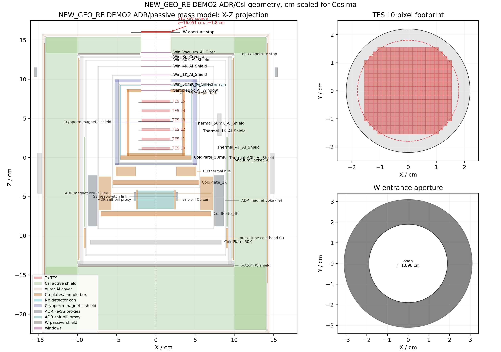

# NEW_GEO_RE Geometry Record

This record describes the Step01 cm-scaled geometry authority:

- DEMO2 source generator:
  `tmp_mass_model_review_bundle/DEMO2/build_demo2_mass_model.py`
- `outputs/geometry/XZTES_ADR_v4c_mkflange_cm/TibetTES_ADR_v4c_mkflange_cm.geo`
- `outputs/geometry/XZTES_ADR_v4c_mkflange_cm/TibetTES_ADR_v4c_mkflange_cm.det`
- `outputs/geometry/XZTES_ADR_v4c_mkflange_cm/bounds.json`

The output path keeps the old `v4c_mkflange_cm` compatibility name, but its
contents are the installed DEMO2 ADR-passive CsI authority.

WRL visualization:

- `TibetTES_ADR_v4c_mkflange_step01.wrl`

## Geometry Claim Level

DEMO2 is the detector-layout reference for this geometry record, but this file
does not claim a fabrication-ready DEMO2 CAD reproduction. The current Cosima
geometry is an engineering background mass model assembled from DEMO2-like
detector layout requirements plus public ADR/cryostat/shielding information and
existing 511 keV telescope concepts.

The schematic now labels the main ADR and passive proxy structures visible in
`bounds.json`, including the Cryoperm magnetic shield, ADR magnet coil and Fe
yoke, salt-pill proxy and Cu can, heat-switch/thermal-bus pieces, pulse-tube
cold-head interface, and Cu/W passive shielding around the dewar.

## Step01 Change

The ADR v4c geometry is not mechanically redesigned. Step01 only normalizes the entrance/aperture model:

- Be-window reference copied from `fix`: radius `1.898 cm`, thickness `0.015 cm`.
- All internal axial holes and all window radii are set to `1.898 cm`.
- A full A4K/Cryoperm magnetic-shield stack is not modeled; the current
  geometry includes one simplified `Cryoperm_Inner_Mag_Shield` mass proxy.
- Thin Al windows are retained at the 50 mK, 1 K, 4 K, and 60 K shield
  apertures.
- The vacuum-jacket aperture is represented by the Be cryostat window plus the
  thin `Win_Vacuum_Al_Filter` proxy.

## Windows

| Window | Material | Radius cm | Thickness cm | Center z cm |
|---|---:|---:|---:|---:|
| `SampleBox_Al_Window` | Al | 1.898 | 0.0025 | 8.5500 |
| `Win_50mK_Al_Shield` | Al | 1.898 | 0.0025 | 9.3150 |
| `Win_1K_Al_Shield` | Al | 1.898 | 0.0025 | 10.5550 |
| `Win_4K_Al_Shield` | Al | 1.898 | 0.0025 | 11.6350 |
| `Win_60K_Al_Shield` | Al | 1.898 | 0.0025 | 12.4350 |
| `Win_Be_Cryostat` | Be | 1.898 | 0.0150 | 12.8425 |
| `Win_Vacuum_Al_Filter` | Al | 1.898 | 0.0030 | 13.4100 |

Detailed cavity/window z audit:

- `stepwise_maintenance/step01_geo/outputs/cavity_window_z_audit.md`

## Apertures

The following axial holes are matched to the Be-window radius `1.898 cm`:

- `TES_SampleBox_Cu`
- `Nb_SC_Detector_Can`
- `Thermal_50mK_Al_Shield`
- `Thermal_1K_Al_Shield`
- `Thermal_4K_Al_Shield`
- `Thermal_60K_Al_Shield`
- `Vacuum_Jacket_Al`
- `CsI_Active_Shield`
- `Outer_Al_Mech_Shell`

The generated cm geometry keeps the TES active thickness at `0.3 cm = 3 mm`.

## ADR And Passive Proxy Labels

| Proxy | Meaning in this mass model |
|---|---|
| `Cryoperm_Inner_Mag_Shield` | Ni-rich magnetic-shield proxy around the Nb detector can. |
| `ADR_Magnet_Coil_Cu` | Copper-equivalent ADR magnet/coil mass inside the 4 K shield. |
| `ADR_Magnet_Yoke_Fe` | Low-carbon steel return-yoke proxy, kept as an important activation/scattering mass. |
| `ADR_SaltPill_Proxy` | Dense GGG-like paramagnetic salt-pill/regenerator proxy below the detector aperture. |
| `ADR_SaltPill_Cu_Can` | Copper can or thermal-strap collar around the salt-pill proxy. |
| `Thermal_Bus_Cu` | Copper thermal bus / heat-switch mass proxy. |
| `ADR_HeatSwitch_Stainless_Link` | Stainless structural/heat-switch link near the salt-pill proxy. |
| `PulseTube_ColdHead_Interface_Cu` | Local pulse-tube cold-head interface mass proxy. |
| `Passive_Cu_Inner_Liner`, `Passive_W_Outer_Liner` | Cu/W passive side shielding outside the dewar. |
| `Passive_Bottom_W_Shield`, `Passive_Top_W_Aperture_Annulus` | Bottom W shield and top annular W aperture stop. |

## Reference Basis

The reference sources recorded in the generator are approximate design
constraints, not proof that the dimensions are final mechanical values:

- Danaher Cryogenics / HPD Model 103 Rainier ADR: ADR experimental-space scale,
  staged cold plates, vacuum jacket, radiation shields, and heat-switch context.
- 511-CAM mission paper: 511 keV telescope focal-plane context, active shield
  outside cryostat, passive tungsten shielding, and Nb/A4K magnetic-shield
  discussion.
- Aluminum vacuum-chamber public information from Kurt J. Lesker: motivation
  for using Al in the vacuum-jacket/outer-mechanical proxy.
- Oxford Instruments Be-window public note: order-of-magnitude Be window
  thickness motivation.
- Existing project/fix geometry: Be-window radius and aperture convention
  (`1.898 cm`) used to keep all axial holes aligned to the entrance window.
