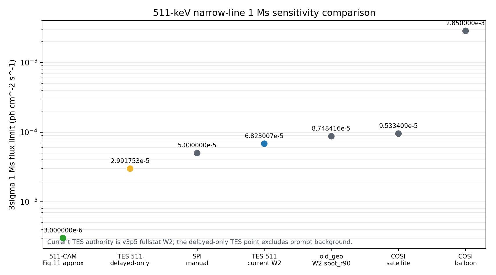

# 511-keV Narrow-Line Sensitivity Comparison

All entries are shown as 3-sigma, 1 Ms minimum distinguishable flux in ph cm^-2 s^-1. Lower is better.

Current TES_511_Balloon authority is the `TES_511_Balloon_v3p5_fullstat_W2_current` row. The old 2.99e-5 row is retained only as a delayed-only aspiration where prompt particle background is excluded.

## Data

| rank | case | flux ph cm^-2 s^-1 | note |
| ---: | --- | ---: | --- |
| 1 | CAM511 | 3.000000e-06 | Fig.11 approximate 511-keV narrow-line 1 Ms marker |
| 2 | TES_511_Balloon_delayed_only_aspiration | 2.991753e-05 | delayed-only aspiration; prompt particle background excluded, not current authority |
| 3 | SPI | 5.000000e-05 | published 3sigma 1e6 s 511-keV narrow-line marker |
| 4 | TES_511_Balloon_v3p5_fullstat_W2_current | 6.823007e-05 | current v3p5 fullstat W2 prompt+delayed background, Step08 1 Ms interpolation |
| 5 | old_geo | 8.748416e-05 | new_geo_re/DEMO2 W2 spot_r90, sqrt-exposure scaled to 1 Ms |
| 6 | COSI satellite | 9.533409e-05 | 1.2e-5 in 2 yr scaled by sqrt(63115200 / 1e6) |
| 7 | COSI balloon | 2.850000e-03 | 3.9e-3 flux at 7.2sigma over 3.08 Ms, scaled to 3sigma and 1 Ms |

## Caveats

- `TES_511_Balloon_delayed_only_aspiration` is not the current performance claim; it removes prompt particle background and is useful only as an upper-bound design aspiration.
- `TES_511_Balloon_v3p5_fullstat_W2_current` is read from the current Step08/performance fullstat output and includes prompt plus delayed W2 background.
- `old_geo` is the local `new_geo_re`/DEMO2 W2 `spot_r90` marker from the existing 1 Ms comparison table.
- `COSI balloon` is scaled from the reported 511-keV line detection flux/significance/exposure, so it is a 511-line detection-equivalent marker rather than a satellite-style point-source survey requirement.
