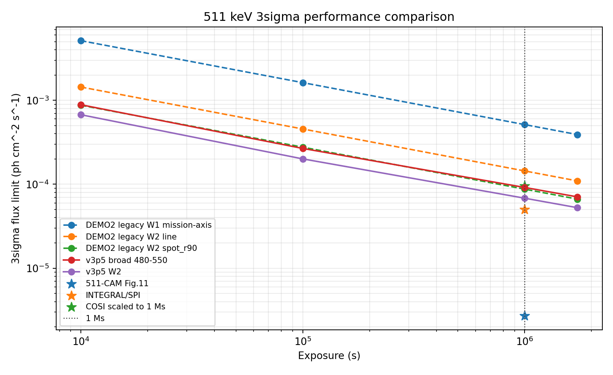
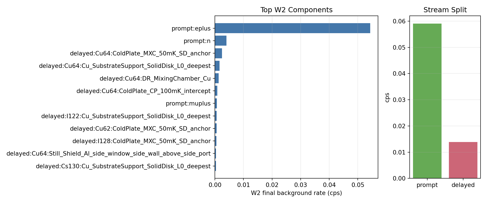

# v3p5 Full-Stat Performance and W2 Background Closure

Status: `PASS_V3P5_FULLSTAT_PERFORMANCE_W2_CLOSURE`.
Authority role: `CONSERVATIVE_RADIALPROFILE_BASELINE_CROSSCHECK`.

Claim level: full-stat v3p5 center-finger L1 rate-level closure with external 1 Ms benchmark markers.

## Technical Summary

- Full-stat Step02 prompt and buildup transport each generated `25210216` / `25210216` particles; delayed transport stored `SE=1000000` over `TE=11531.6 s`.
- W2 final background is `0.0729576 cps` with signal `0.00118117 cps` at `1e-4 ph cm^-2 s^-1`; the mission-mean Step06 fold is `0.0730428` / `0.00117281 cps`.
- The Step08 time-dependent W2 result is `Z20d=5.70221`, `T3=5.46687 day`, and `F_3sigma(20d)=5.261115e-05 ph cm^-2 s^-1`.
- The 1 Ms comparison gives v3p5 W2 `F_3sigma=6.823007e-05 ph cm^-2 s^-1`; external markers are included for 511-CAM, SPI, and COSI with source notes in the JSON.

## Key Findings With Visual Evidence

The performance curve places the full-stat v3p5 W2 point against legacy pre-fix DEMO2 headline cases and public instrument markers at 1 Ms. The DEMO2 points are historical markers under review after the reproduced x8.0116 delayed-source normalization issue; the external points are benchmarks with different assumptions.

| case | 1 Ms 3sigma flux ph cm^-2 s^-1 | method |
| --- | ---: | --- |
| v3p5 W2 | 6.823007e-05 | v3p5_time_dependent_cumulative_interpolation |
| DEMO2 legacy W2 spot_r90 | 8.748416e-05 | legacy_pre_fix_documented_20d_Z_sqrt_exposure_scaling |
| DEMO2 legacy W2 line | 1.441678e-04 | legacy_pre_fix_documented_20d_Z_sqrt_exposure_scaling |
| 511-CAM Fig.11 | 2.700000e-06 | digitized_from_511CAM_Fig11_right_panel_at_511keV |
| INTEGRAL/SPI | 5.000000e-05 | published_3sigma_1e6s_511keV_narrow_line |
| COSI scaled to 1 Ms | 9.533409e-05 | sqrt_time_scaled_from_published_2yr_3sigma_narrow_line_point_source_sensitivity |

## Benchmark Sources

- DEMO2/new_geo_re comparison values come from legacy pre-fix `core_md/README.md` and `core_md/VALIDATION.md` records. They are retained as provenance only after the reproduced x8.0116 delayed-source normalization issue; the legacy `stepwise_3sigma_headline_results.png` file named in older notes is not present in this checkout.
- 511-CAM is digitized from Fig.11 of arXiv:2206.14652 and treated as a figure-derived 1 Ms marker.
- INTEGRAL/SPI uses the published 3sigma, 10^6 s, 511 keV narrow-line sensitivity from arXiv:astro-ph/0310793.
- COSI uses the published 2-year 3sigma narrow-line sensitivity from arXiv:2308.12362, sqrt-time scaled to 1 Ms for this benchmark plot.

The W2 background-source breakdown reuses the same Step05 W2, active-veto, and side-entry Compton/FoV selection. The rate total is checked against the Step05 W2 background, so the decomposition is tied to the sensitivity calculation rather than a separate event filter.

## W2 Background Driver

The largest selected component is `prompt:eplus` with `80` selected events, `0.0543377 cps`, and `74.5%` of the W2 final background rate.
The delayed slice is small; within delayed-only W2 events, `Cu64` is the largest nuclide with `84` events and `52.5%` of delayed W2 events.

## Scope, Data, And Metric Definitions

- W2 is `510.58-511.42 keV`, i.e. `511 +/- 420 eV`.
- Reference flux is `1e-4 ph cm^-2 s^-1` unless a row explicitly reports a 3sigma flux limit.
- Full-stat label is `fullstat_v2`.
- 1 Ms means `1,000,000 s` exposure.
- Background and signal rates are Step05 L1 side-entry Compton/FoV selected rates, folded through Step06/07/08 for mission-time significance.
- Boundary sidecars are packaged at `outputs/reports/v3p5_boundary_closure_20260613/v3p5_boundary_closure_report.md`.

## Methodology

Step02 produces the full-stat prompt, buildup, fixed delayed source, and delayed transport. Step05 parses prompt, delayed, and focused EventList detector outputs with the v3p5 active-veto and side-entry Compton/FoV selection. Step06 applies the mission time axis; Step07 builds source cases; Step08 computes time-dependent counting significance with analytic accidental-live factors. The performance comparison converts the Step08 cumulative significance to 3sigma flux limits at fixed exposures and adds public 1 Ms markers.

## Boundary Closure Sidecars

- 45 deg LOS W2 sidecar: `Z20d=5.02544`, 20-day 3sigma flux `5.969625e-05` ph cm^-2 s^-1.
- 45 deg LOS `spot_r90` sidecar: `Z20d=7.20533`, 20-day 3sigma flux `4.163585e-05` ph cm^-2 s^-1.
- Fixed-template multi-annulus spatial-likelihood sidecar: `Z20d=8.45804`, 20-day 3sigma flux `3.546920e-05` ph cm^-2 s^-1.
- Exact-position delayed-source status: `SOURCE_AUDITS_PASS_TRANSPORT_NOT_RERUN`.
- Exact-position feasibility status: `EXACT_RPIP_POINTSOURCE_SMOKE_VALIDATED_NOT_PRODUCTION_RERUN`.

## Limitations And Robustness Checks

- This fullstat_v2 closure is the conservative radial-profile baseline cross-check; fullstat_v2_exactpos is the current rate authority after the M/seed convergence report.
- This is an L1 rate-level full-stat closure; boundary sidecars close the 45 deg LOS normalization and fixed-template annular spatial-likelihood checks, but they are not a nuisance-profile publication analysis.
- The production delayed transport still uses the legacy axisymmetric RadialProfileBeam compression for v3p5; exact-RPIP PointSource sampling is smoke-validated but not yet rerun at fixed-inventory production scale.
- 511-CAM is figure-derived from Fig.11; COSI is sqrt-time scaled from a published 2-year sensitivity and is a benchmark marker, not an observing-strategy equivalence.
- Flux limits use Gaussian S/sqrt(B)=3 scaling for comparison consistency.

## Recommended Next Steps

- Promote the smoke-validated exact-RPIP PointSource path to a v3p5 fullstat fixed-inventory production delayed source and rerun delayed transport.
- Promote the fixed-template annular sidecar to a nuisance-profile publication likelihood only if that claim is needed.
- Re-digitize or table-source external benchmark curves before any publication figure.

## Further Questions

- How much does exact-position delayed sampling move the W2 background mix?
- Does a nuisance-profile spatial likelihood materially improve beyond the current fixed-template annular sidecar?
- Which external benchmark definitions should be normalized for field of view, line width, and observing strategy in a publication table?

## Artifact Index

- summary JSON: `outputs/reports/v3p5_fullstat_performance_w2_closure_20260612/v3p5_fullstat_performance_w2_closure_summary.json`
- HTML report: `outputs/reports/v3p5_fullstat_performance_w2_closure_20260612/report.html`
- copied summaries: `summaries/`
- copied tables: `tables/`
- copied figures: `assets/`
